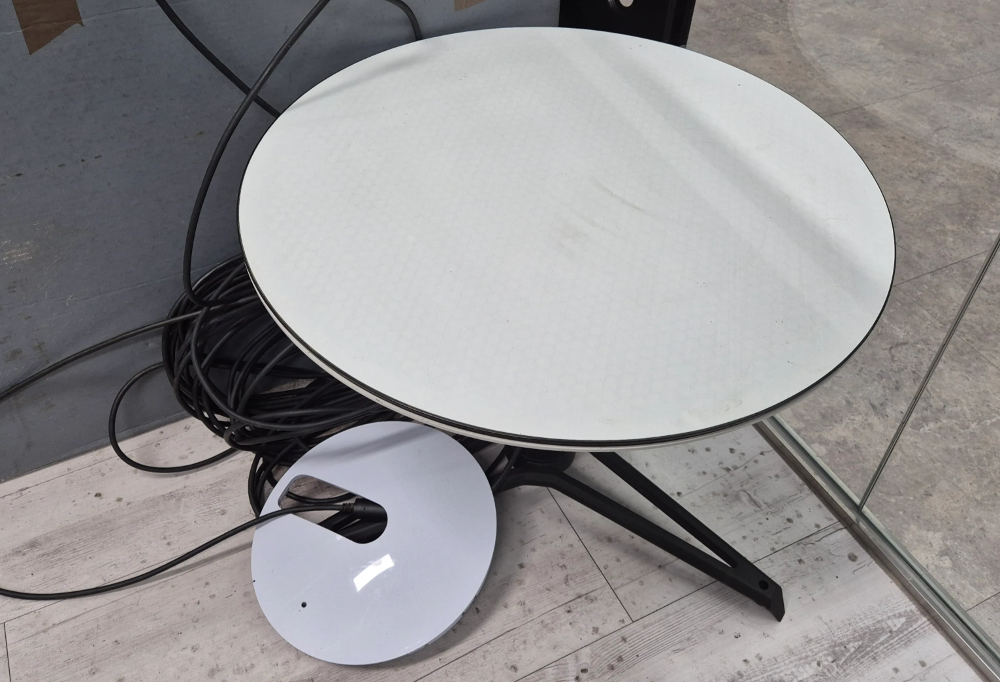
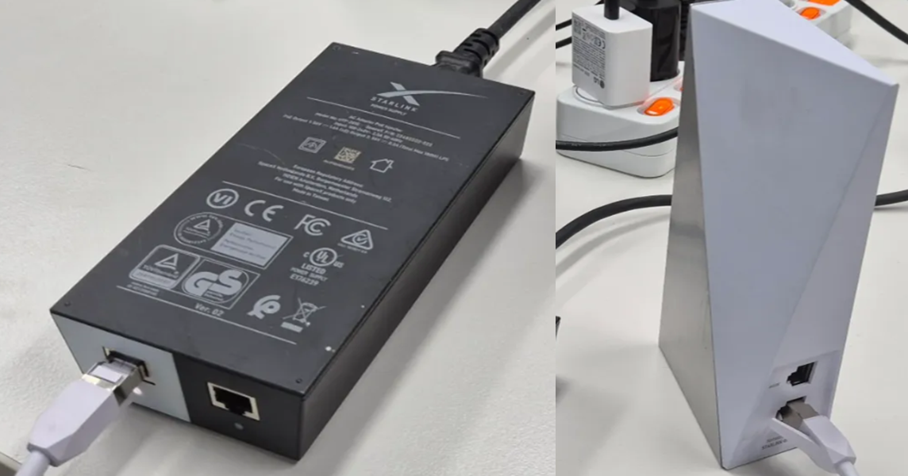
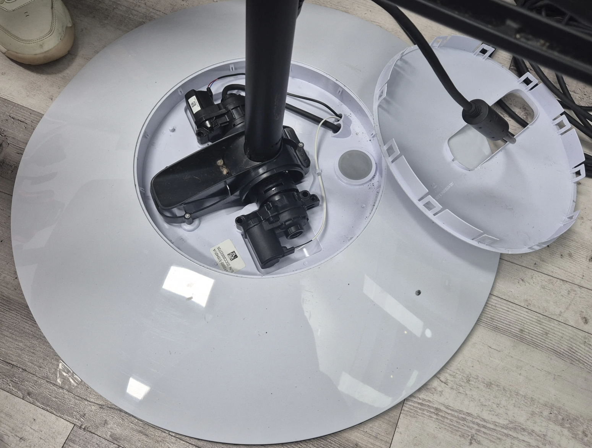
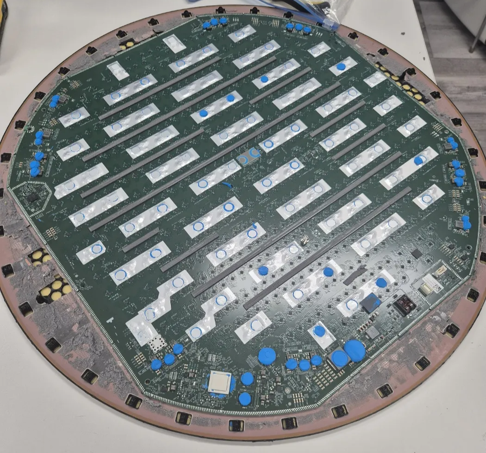
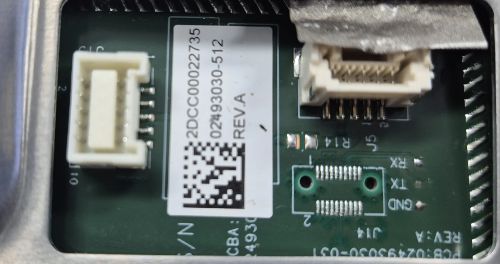
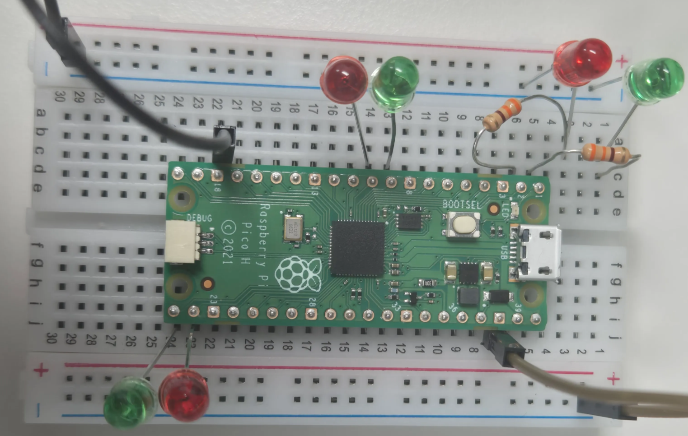
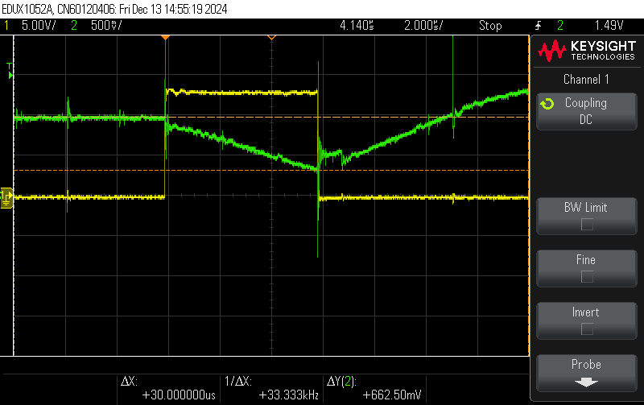

# Standard Circular(V1)

## 1. TearDown & Extracting Firmware

### 1.1. TearDown & UART 확인

1. 목적 및 배경
    - Starlink V1 DISHY의 Teardown과정을 공유한다.
    - V1 DISHY은 beta 버전과 정식 버전이 존재하는데 우리는 각각 1대를 구매했다.
    - TearDown은 동일하지만 PCB 배열은 다르다.
2. 작업 과정
    1. V1 DISHY의 구성품
        - V1 DISHY→ LAN 선 일체형으로 동작한다.
            
            
                                                   
        - 라우터와 전원 - PoE Port로 연결하여 사용한다.
            
            
            
    2. V1 Teardown
        - 뒤판 벗기기 - 드라이버를 이용해 커버를 벗겨낸다.
            
            
            
        - 커버를 벗기고 원형의 안테나만 노출이 된다.
        - 열풍기와 드라이버를 이용해서 쇠판을 벗겨낸다.
            
            
            
            
            
        - 기판을 확인 할 수 있다.
    3. UART 확인
        - 전원 단자 옆에 Uart가 노출되어 있는 것을 확인 할 수 있다.
            
            
            
        - 로그 출력 결과
            - RX - 응답이 없다.
            - TX - 응답이 없다.
            - GND - 기판의 GND와 연결되어 있다.
    4. PCB Layout 확인
        - ModChip이 동작하는 V1 DISHY와 비교한다.
            
            
            
            label이 전부 프린트 되어 있고, 양면테이프 및 방열 패드가 많다
            
    5. ModChip 작업 시 문제점
        - ModChip에서 설명하는 기판과 Layout이 달라 해당 TP를 찾아야 하는 어려움이 있다
            
            
            
    6. V1 추가 구매 진행
        - 위 과정을 동일하게 진행하고 ModChip이 동작하는 V1과 동일한 것을 확인했다.
    7. 연결 방법 및 차이점
        - V1은 PoE 기능이 있는 장비가 별도로 있다.
        - V4는 Adapter 에서 Router(PoE)에 연결하고 Router에서 Dish로 연결한다.
            
            
            
3. 결론
    - UART를 확인했으나 Disable 되어 있다.
    - SD Card Reader를 이용하면 Firmware Extracting이 가능하다.
    - V1 DISHY 상용 버전에서 ModChip 장착이 가능하다.
    - V1(beta) DISHY 는 커스텀 Firmware Rewriting이 가능하다.

---

### 1.2. Firmware Extracing & Rewriting

1. 목적 및 배경
    - V1 DISHY 에서 Firmware  Extracting/Rewriting 방법에 대한 연구이다.
2. 방법
    1. **eMMC TP 확인**
        - D0, CMD, CLK, GND, 1.8V, 3.3V 찾는다.
            
            
            
    2. **SD Card구입**
        - data에 1.8v 를 받아서  3.3v로 level shift를 해준다.
            
            https://shop.exploitee.rs/shop/p/low-voltage-emmc-adapter
            
            
            
        - 찾은 신호를 기반으로 SD Card를 연결하고 납땜을 완료한다.
            
            
            
    3. **Firmware Extracting**
        - Linux에서 파일 시스템 mount 후에 Firmware Extracting 한다.
        - SD Card Reader - SD Card - PCB 연결 시도한다.
            
            
            
        - Mount 및 명령어 실행 결과는 아래와 같다.
            
            ```
            $ sudo fdisk -l
            .......................중략......................
            Disk /dev/sdb: 3.53 GiB, 3791650816 bytes, 7405568 sectors
            Disk model: USB SD Reader   
            Units: sectors of 1 * 512 = 512 bytes
            Sector size (logical/physical): 512 bytes / 512 bytes
            I/O size (minimum/optimal): 512 bytes / 512 bytes
            
            $ sudo dd if=/dev/sdb of=v1_dishy.bin bs=512 status=progress conv=fsync
            3789931008 bytes (3.8 GB, 3.5 GiB) copied, 739 s, 5.1 MB/s 
            7405568+0 records in
            7405568+0 records out
            3791650816 bytes (3.8 GB, 3.5 GiB) copied, 739.632 s, 5.1 MB/s
            
            $ ll
            -rw-r--r-- 1 root     root     3.6G 12월 15 14:18 v1_dishy.bin
            ```
            
    4. **Firmware Rewriting**
        - Linux에서 dd 명령어를 사용하면 Rewriting 할 수 있다.
            
            ```
            $ sudo dd if=v1_new.bin of=/dev/sdb bs=512 status=progress conv=fsync 
            3791315456 bytes (3.8 GB, 3.5 GiB) copied, 3328 s, 1.1 MB/s
            dd: fsync failed for '/dev/sdb': Input/output error
            7405568+0 records in
            7405568+0 records out
            3791650816 bytes (3.8 GB, 3.5 GiB) copied, 3335.05 s, 1.1 MB/s
            ```
            
3. 결론
    - 참고 - https://github.com/KULeuven-COSIC/Starlink-FI
    - Level Shift가 있는 SD Card가 있어야 한다.

---

## 2. Glitching 연구

### 2.1. ModChip PCB 제작

1. **목적**
    - 임베디드장비 분석에 필요한 하드웨어 제작에 대해 의뢰부터 문제점 그리고 진행 사항에 대한 전체적인 진행 사항을 공유하여 추후 PCB 제작에 도움이 될 수 있도록 해야 한다.
2. **업체 선정**
    - 전자부품 쇼핑몰 디바이스XX 에서 견적 요청을 통해 제작 의뢰를 했다.
3. **용어 관련 질문 내용 공유**
    - 부품이 사양은 같아도 크기가 다를 수 있다.
    - 용어
        - 스루반스루홀 - 말 그대로 반원 모양으로 pcb가 구멍이 통하게 제작되는 것을 말한다.
            
            
            
        - 미삽 - 미 삽입 한다. 부품에는 존재하지만 PCB상에는 존재하지 않는다.
    - 부품에 대한 최소 주문 수량 확인
        - 일반적으로 저항이나 캐패시터는 100개 이상을 최소 단위 주문으로 본다.
        - PCB 제작도 최소 주문 수량을 확인 해야 한다.
    - 조립 비용 확인
        - 조립은 기계로 하는 것과 손으로 직접 하는 것으로 주문이 가능하다.
4. **최종 견적서**
    - 견적서를 받고 작업을 시작하면 부품 수급부터 조립 완료까지 2주 정도 소요된다.
        
        
        

---

### 2.2. ModChip 회로도 검토

1. **목적**
    - 회로도를 검토하고 ModChip에 대한 동작을 유추한다.
2. **전체 부품 위치 표기** 
    - ModChip에서의 부품 별 위치는 아래와 같다.
        
        
        
3. **각 파트 별 동작 확인**
    - J1 J2 U3 회로도 해석
        
        
        
    - J1 - USB 입력
        - VBUS(1) : 5V 전원 입력
        - USB_D+ / USB_D- : 데이터 라인
    - J2 - 전압 선택
        
        점퍼를 사용하여 USB 전원 또는 외부 전원 중 하나를 선택한다.
        
        - PIN 1 : USB의 5V 입력 사용
        - PN 3 : 외부 입력 12V
    - U3 - 전압 레귤레이터
        
        입력 전압(5V or 12V)을 안정적으로 3.3V로 변환
        
        
        
    - U2 해석
        
        레벨시프터 : 1.8V ↔ 3.3V 전압 변환
        
        
        
        - A(1.8v) → B(3.3v) 로 전압 변환 : UT-TX → GPIO_TRIG 신호 생성
        - R1, R3(10k) : 풀업 저항
    - U1 해석
        
        MOSFET(Q1)와 MOSFET 드라이버(U1)를 사용하여 전원(vcore)의 On/Off를 제어, GPIO_GLITCH 입력으로  Q1의 게이트를 제어
        
        - Q1 : n-채널 MOSFET : U1의 출력을 따라 전류가 흐르게 하여 vcore 제어
            
            
            
    - Q2 Q3 해석
        
        vcore 전압 제어 및 안정화를 수행
        
        
        
        - n 채널 MOSFET: gate_cap 신호에 따라 전류를 스위칭하며 vcore 전압을 on/off 제어
    - Raspberry Pi (RP2040)
        
        
        
        - J1(USB-B Micro) : USB를 통해 전원을 공급하고 데이터 통신을 수행한다.
        - GPIO 신호 정보

---

### 2.3. RP2040을 이용한 동작 검증

1. 목적
    - ModChip에서 rp2040을 제어하는 방법에 대해서 연구한다
    - Glitching 방법에 대해 숙지하고 응용할 수 있는 방법을 연구한다.
2. 선행 연구
    1. PCB 연구 내용
        
        https://github.com/KULeuven-COSIC/Starlink-FI 
        
        - PCB 전체 이미지
            
            
            
        - PORT 할당 및 동작 방법은 그림과 같다.
            
            
            
    2. Firmware 준비 과정
        - `modchipfw` **소프트웨어 빌드**
            
            ```
            sudo apt update
            sudo apt install cmake
            mkdir build && cd build
            cmake ..
            ====================================================================
            $ cmake ..
            CMake Error at pico_sdk_import.cmake:44 (message):
              SDK location was not specified.  Please set PICO_SDK_PATH or set
              PICO_SDK_FETCH_FROM_GIT to on to fetch from git.
            Call Stack (most recent call first):
              CMakeLists.txt:13 (include)
            
            -- Configuring incomplete, errors occurred!
            ====================================================================
            
            make
            ```
            
            cmake에서 Error가 발생한다. 내용을 보니 다음과 같은 환경 구성이 되어야 한다.
            
        - **개발 환경 구성 방법**
            
            빌드부터 실행 파일 생성까지 전 과정을 정리한다.
            
            (1) Toolchain 설치
            
            ```
            sudo apt update
            sudo apt install gcc-arm-none-eabi build-essential
            ```
            
            (2) SDK 설치
            
            ```
            #pico SDK clone
            mkdir -p ~/pico
            cd ~/pico
            git clone https://github.com/raspberrypi/pico-sdk.git
            cd pico-sdk
            git submodule update --init
            
            # 환경 변수 설정
            echo "export PICO_SDK_PATH=~/pico/pico-sdk" >> ~/.bashrc
            source ~/.bashrc
            ```
            
            (3) Cmake 설치
            
            ```
            sudo apt install cmake
            ```
            
            (4) 빌드
            
            ```
            sudo apt update
            sudo apt install cmake
            mkdir build && cd build
            cmake ..
            make
            ```
            
            (5) RP2040에 업로드
            
            - RP2040 부팅 모드로 연결한다.
            - Boolsel 버튼 누른 상태에서 USB케이블 연결한다.
            - 생성된 파일(.uf2) 파일을 드라이브로 복사한다.
    3. **호스트 Python 프로그램 실행**
        - Python 폴더에서 `pulsegen.py`이 파일 에는 `PicoPulseGen`을 정의하고 있다.
        - `example.py`을 통해 실제 동작을 제어 한다.
    4. Firmware 코드 분석
        - **rp2040에 들어가는 fw 분석**
        - utglitcher.c - PORT 할당과 ModChip 동작을 정의한다.
            
            ```
            --- 코드 중략 ---
            // GIO PORT를 위한 환경 설정
            #define PIN_NRST   7
            #define PIN_TRIG   6
            #define PIN_PULSE  0
            #define PIN_CAPS   1
            
            #define PIN_LED1   16
            #define PIN_LED2   17
            
            --- 코드 중략 ---
            # PORT 초기화
            
                while (true) {
                    cmd = getchar(); --  입력
                    
                    switch (cmd)
                    {
                        case 'A': // pio상태머신 활성화, 
            								--- 코드 중략 ---
                            break;
            
                        case 'B': // Trigger 대기 및 Pulse 출력
            								--- 코드 중략 ---
                            break;
                        
                        case 'E': // edges 값 설정
            								--- 코드 중략 ---
                            break;
            
                        case 'O': // Offset 값 설정
            								--- 코드 중략 ---
                            break;
                        
                        case 'W': // width 값 설정
            								--- 코드 중략 ---
                            break;
            
                        case 'S': // 설정 값 출력
            								--- 코드 중략 ---
                            break;
            
                        // control a gpio pin, can be expanded to handle multiple pins
                        case 'G': // Gio Pin 설정
            								--- 코드 중략 ---
                            break;
            
                        case 'R': // GIO Pin 상태 정보 출력
            								--- 코드 중략 ---
                            break;
            
                        default:
                            break;
                    }
                }
                return 0;
            }
            ```
            
            
            
        - **pulsegen.py**
            - PicoPulseGen Class로 시리얼 통신을 통해 Firmware를 구동 시킨다.
            - 실제 동작시키는 프로그램을 작성할때 class를 활용하여 구현해야 한다.
            
            ```
            class PicoPulseGen:
                def __init__(self, port='/dev/ttyACM0'):
                --- 코드 중략 ---
                
                @pulse_offset.setter
                def pulse_offset(self, offset): // 'O' 명령어
            		--- 코드 중략 ---
                
                @pulse_width.setter
                def pulse_width(self, width): // 'W' 명령어
            		--- 코드 중략 ---
            		
                @trig_edges.setter # edges의 수를 설정
                def trig_edges(self, edges):
            		--- 코드 중략 ---
                    
                def arm(self): # 글리치 장치를 활성화한다.
            		--- 코드 중략 ---
            
                def wait_trig(self, timeout=5): # 트리거 신호 대기하고 pulse를 출력한다.
            		--- 코드 중략 ---
            ```
            
        - **example.py**
            
            ```
            ser = serial.Serial('/dev/ttyUSB0', 115200) # UART 연결한다.
            		--- 코드 중략 ---
            glitcher = PicoPulseGen('/dev/ttyACM0') # ModeChip과 연결한다.
            		--- 코드 중략 ---
            glitcher.trig_edges = 0 # 설정값 초기화
            glitcher.pulse_offset = 0
            glitcher.pulse_width = 0
            glitcher.set_gpio(0)
            
            input("Press enter to start.")
            		--- 코드 중략 ---
            def generator():
            	while True:
            		yield
            
            idx = 0
            success = False
            for _ in tqdm(generator()):
            	# 설정값을 변경하면서 Glitching을 동작 시킨다.
            	# UART에서 식별가능한 문자열을 확인하여 성공여부를 결정한다.
            			--- 코드 중략 ---
            ```
            

1. RP2040 + 브레드 보드를 이용한 시뮬레이션 검증
    1. 준비내용 및 시나리오
        - RP2040 + LED를 구매해서 실제로 동작하는지 확인한다.
        - **구매내역**
            - 라즈베리파이 피코 H(Raspberry Pi Pico H)
            - LED(초록10, 빨강10)
            - 브레드 보드
            - 저항(330옴)
        - **TEST 시나리오**
            - rp2040 에 넣을 FW를 받아 동작 시킨다
            - pulse edges, width, offset을 설정하고 pulse를 LED를 통해서 본다
            - python 프로그램이 정상 동작하는지 확인한다.
    
    2. 환경 구성 및 구현
    
        - **PORT 할당**
        - RP2040 사양서를 확인하고 할당된 PORT를 확인한다.
        
            
        
            ```
            #define PIN_NRST   7 // GP7
            #define PIN_TRIG   6 // GP6
            #define PIN_PULSE  0 // GP0   --> 실제 PULSE가 출력되는 PIN
            #define PIN_CAPS   1 // GP1
            #define PIN_LED1   16 // GP16
            #define PIN_LED2   17 // GP17
            ```
        
        - GP0, GP1, GP6, GP7, GP16 GP17번을 6개에 대해서 LED를 연결한다.
        
            
        
    
    3. ModChipFW 준비 - 컴파일 후 다운로드 실행
    
        - 빌드를 통해 FW를 준비한다.
        
            [utglitcher.uf2](https://github.com/bob13-spacepirate/Starlink_Research/blob/main/Hardware/Standard%20Circular(V1)/Script/utglitcher.uf2) 
        
        - rp2040의 Reset + 커넥터를 off/on 하면 외장 드라이브처럼 읽힌다.
        - 이때 위 첨부 파일을 첨부하면 firmware 다운로드가 된다.
    
    4. 동작 확인 및 실행
    
        - Python  프로그램 일부 수정
        
            눈에 보이게 하기 위해 Pulse/Width 값 변경
        
            [glitching.py](https://github.com/bob13-spacepirate/Starlink_Research/blob/main/Hardware/Standard%20Circular(V1)/Script/glitching.py) 
        
            ```bash
            A, B =  125000, 125000 # 500ms 
            C, D =  125000, 125000 # 500ms
            ```
        
            실행 방법
            
            ```
            sudo chmod 666 /dev/ttyACM0
            python3 glitching.py 
            ```
        

2. 결론
    - ModChip 이 제작되기 전에 RP2040을 이용해서 동작만 확인했다.
    - 설정 값을 확인하면서 동작이 정상적으로 동작하는지 확인했다.
    - 사전 연구에서 진행 했던 ModChip 의 Firmware는 수정 사용 가능하다.

---

### 2.4. V1(beta) eMMC 신호 식별 및 ModChip 부착 방법 연구

1. 목적
    - V1의 Beta 버전은 선행연구와 다른 Layout을 가지고 있다.
    - SD Card를 연결할 신호 (D0, CLK, CMD) TP를 찾아야 한다.
    - eMMC와 SD reader 연결하고 FW Extracting/Rewriting 수행 가능하도록 연결한다.
    - Modchip 부착에 필요한 사항들을 연구한다.
2. 검증 내용
    1. eMMC 신호 식별 방법
        - eMMC 구조 및 SC Card Reader 연결 부분 확인
            
            
            
            
            
            CMD / CLK / D1를 찾아 SD CARD와 연결한다. 
            
            eMMC를 동작 시켜 Extracing/Rewriting를 할 수 있어야 커스텀 FW를 만들 수 있다.
            
        - 선행 연구 정리
            - https://www.esat.kuleuven.be/cosic/blog/dumping-and-extracting-the-spacex-starlink-user-terminal-firmware/
                
                
                
                연구에 따르면 3개의 pin D0 / CLK / CMD를 찾았고, 그것을 이용해 SD CARD이용해 Extracting를 한다.
                
                
                
            
            이때의 전원은 3.3V , 1.8V 를 emmc에 제공해야 하는데 3.3V는 SD Card에서 1.8V는 외부에서 사용했다.
            
        - V1(Beta) 장비 PCB Layout
            - D0, CMD, CLK을 찾기 위해 TP40~TP49 번을 logic analyer 와 오실로스코프로 확인했다.
                
                
                
                
                
        - 식별신호 정리
            - SD CARD VCC 는 3.3V 사용한다.
            - UART USB 에서 1.8V 제공한다.
            - CMD / CLK / D0 후보군 확인 후 SD card 연결해서 노트북으로 파일 읽기 시도 반복 적으로 수행하면서 해당 PIN 찾는다.
            - CMD /CLK/DO의 신호 예시
                
                
                
            - **CLK 신호 -** 주기적인 신호
            - **CMD 신호 -** 주기적 신호 + 깔끔한 구간 존재, ****전송 시작과 종료 시의 패턴을 통해 식별
            - **D0 신호 -** 데이터 전송시 활성화, 전송이 끝나면 비활성화
                
                
                
            - **D0**는 LSB를 전송하며, 가장 빈번한 변화를 보인다
            - **D7**은 MSB를 전송하며, 상대적으로 변화가 적다.
            - 다른 데이터 라인(D1~D6)은 이 사이의 비트를 전송하며, 각각의 패턴이 다르게 나타난다.
                
                
                
            - 위 신호를 보고 다음과 같이 유추 한다.
                - D0 → CLK
                - D1 → CMD
                - D6 → D0
            - 식별이 완료된 상태에서 SD Card를 연결한다.
                
                
                
                
                
    2. ModChip 부착 방법 연구
        - 선행 연구에서 언급한 Modchip 장착 시 필요한 내용을 정리한다.
            
            
            
        - UART가 나오지 않기 때문에 TX 대신 D0를 Trigger로 사용해야 한다.
        - Decoupling Capacitor  제거
            - PCB위치가 다르기 때문에 위치 확인 필요
            - 추후 동일한 PCB에서 제거 예정
        - Modchip 정렬 및 납땜 - PCB 위치 확인 필요
        - castellate Hole 위치와 UT RST 연결
        - Core Voltage requlator enable pin에 연결
        - 12v 연결
        - eMMC D0 연결
        - 1.8v 연결
3. 결론
    - Signal Analyzer를 이용해서 CLK, CMD, D0 식별 했다.
    - SD Card를 연결하여 메모리 Extracting/Rewriting 가능하여 커스텀 FW작업을 수행할 수 있다.
    - ModChip 제작이 완료 되면 바로 할 수 있도록 준비가 된 상태이다.

---

### 2.5. V1 ModChip 동작 검증

1. 목적
    - V1 Dish에 직접 Glitching을 하기 전에 PCB에서 동작하는 FW를 검증을 완료한다.
2. Firmware 검증 방법
    - ModChip에서 12V 전압이 필요한데 외부에서 줄 수 없어 전체 동작은 브레드보드를 이용해 검증을 수행하고 시뮬레이션 공유기를 이용하여 TX신호를 입력으로 받아 동작을 검증한다.
        
        
        
    - 검증이 완료 되면 Firmware는 준비가 완료된 것으로 확인 한다.
    - 준비된 Firmware를 사용하여 ModChip의 최소한의 동작을 검증한다.
3. 검증 순서
    1. Firmware 준비 내용
        - Modchip 의 RP2040의 Firmware
        - Modchip 동작을 위한 python 프로그램
        - 시뮬레이션용 공유기
    2. Firmware 분석
        - rp2040 Firmware - c코드
            
            [utglitcher.c]() 
            
            - rp2040 C코드의 명령 별 기능을 정리
                
                
                | 명령 | 기능 |
                | --- | --- |
                | 'A' | 상태 머신 활성화 및 Trigger설정 |
                | 'B' | Trigger대기 및 Toggle테스트 |
                | 'C' | GPIO 상태 확인 |
                | 'E' | Trigger에지 수 설정 |
                | 'O' | Pulse Offset 설정 |
                | 'W' | Pulse 폭 설정 |
                | 'S' | 현재 설정 정보 출력 |
                | 'G' | GPIO 제어 |
                | 'R' | GPIO 상태 이진 출력 |
            - 동작 프로그램 - utglitcher.c
        - rp2040 Firmware - PIO 어셈블리 코드
            
            [pulsegen.pio]((https://github.com/bob13-spacepirate/Starlink_Research/blob/main/Hardware/Standard%20Circular(V1)/Script/pulsegen.pio)) 
            
            - Edges 신호의 수를 Count하고 Glitching Offset과 Pulse신호를 생성한다.
        - 동작 프로그램 - pulsegen.pio
        - python 실행 코드 작성
            
            [glitching.py]((https://github.com/bob13-spacepirate/Starlink_Research/blob/main/Hardware/Standard%20Circular(V1)/Script/glitching.py))  
            
            - UART연결 후 rp2040 firmware 동작 제어하기 위한  class 파일 - **pulsegen.py**
            - 동작 프로그램 - glitching.py
        - wsl2에서 위의 파이썬 실행방법
            - wsl2상에서 포트와 연결하려면 설정이 필요하다.
            - https://velog.io/@pikamon/Linux-6
            - usbipd bind --busid ?-? 으로 shared로 바꿔준다.
            - usbipd attach —wsl —busid
                
                
                
                
                
                
                
            - 윈도우에서 Firmware  넣어주고 wsl에 연결시켜야 한다.

1. Firmware 검증 결과
    - RP2040 및 Modchip에서 Edges 수 검출을 기준으로 Offset, Pulse 동작을 확인한다.
    - rp2040 + bread board + iptime 공유기 + rs232 uart jig 검증한다.
        
        
        
        특정 문자열(”**killall”)**이 검출되면 Glitching이 성공하는 것으로 간주한다.
        
        ```
        
        9it [00:49,  4.93s/it]
          -- trig_edges setter = b'167\r\n'
        
          -- pulse_offset setter = b'179437713\r\n'
        
          -- pulse_width setter = b'565928140\r\n'
        log = b"  LAN MAC : 00:00:00:01:01:10\r\n  WAN MAC : 00:00:00:01:01:11\r\nBridge Init\r\ndevice wlan1-va0 is not a slave of br0\r\ndevice wlan1-va1 is not a slave of br0\r\ndevice wlan1-va2 is not a slave of br0\r\n----> Regulated Power: 
        ---------------------- 중략 ------------------------
        \ndevice wlan0-vxd is not a slave of br0\r\niptables: No chain/target/match by that name.\r\n'
        11it [00:57,  4.46s/it]
          -- No trigger observed, disarming!
        log = b"init_iptv_config ---> 2\r\nInitialized Time: 1388502000\r\nRestart HTTPD\r\nKill httpdkillall: httpd: no process killed\r\nStart httpdkillall: dhcpd: no process killed\r\nkillall: bcrelay: no process killed\r\nkillall: pptpd: no process killed\r\niptables: Bad rule (does a matching rule exist in that chai\
        
        ---------------------- 중략 ------------------------
        
        0\r\niwcontrol RegisterPID to (wlan1)\r\niwcontrol RegisterPID to (wlan0)\r\niwcontrol RUN OK\r\n**killall**: apcpd: no process killed\r\nEnable HW NAT\r\nCPU -> system type\t\t: RTL8197F\r\nFirst Time ---> No WAN IP -> Dummy WAN IP Set\r\nInit HW NAT -> Local Down/UP\r\nClear WAN IP\r\nInit HW NAT -> END\r\nkillall: pppoe-relay: no process killed\r\nSession Garbage Collecting:Maybe system time is updated.( 1388502005 0 )\r\nUpdate Session timestamp and try it after 5 seconds again.\r\nez_ipupdate callback --> time_elapsed: 0\r\n"
        11it [01:03,  5.76s/it]
        **Glitch successul!**
        ```
        
2. ModChip 동작 검증
    
    a. 환경
    
    - 준비된 Firmware
      
        [pulsegen.pio](https://github.com/bob13-spacepirate/Starlink_Research/blob/main/Hardware/Standard%20Circular(V1)/Script/pulsegen.pio)
        
        [utglitcher.c](https://github.com/bob13-spacepirate/Starlink_Research/blob/main/Hardware/Standard%20Circular(V1)/Script/utglitcher.c)
        
        [utglitcher.uf2](https://github.com/bob13-spacepirate/Starlink_Research/blob/main/Hardware/Standard%20Circular(V1)/Script/utglitcher.uf2)
        
        [pulsegen.py](https://github.com/bob13-spacepirate/Starlink_Research/blob/main/Hardware/Standard%20Circular(V1)/Script/pulsegen.py)
        
        [glitching.py](https://github.com/bob13-spacepirate/Starlink_Research/blob/main/Hardware/Standard%20Circular(V1)/Script/glitching.py)
        
    - TRIG입력은 시뮬레이션 RS232를 입력한다.
    - 외부 전원(1.8v)  인가를 위해 rs232의 1.8V를 이용한다.
    - Firmware를 다운로드 하고  python 프로그램을 실행한다.
        - Offset=2ms, width=1ms을 설정한다.
    
    b. 동작 수행
    
    - 오실로스코프로 GPIO_GLITCH 와 GPIO_CAP 신호를 측정한다.
        
        
        
        offset = 1000000 = 2ms (계산→ 1000000/250000000 = 2ms)
        
        glitch = 500000 = 1ms (계산→ 500000/250000000 = 1ms)
        
        cap = offset + glitch = 2ms + 1ms = 3ms
        
3. 결론
    - Glitching을 위한 Firmware 검증이 완료 되었다.
    - ModChip 의 기능상 문제 없음을 확인 했다.

---

### 2.6. V1 ModChip 장착 후 검토

1. 목적
    - Modchip을 장착 후 V1이 정상 부팅이 되지 않는다.
    - eMMC Extracting로 기존 FW를 백업 받는다.
    - Modchip 동작을 검증한다.
    - Modchip과 V1 연결된 부분을 확인한다.
2. 전체 연결 상태
    - V1 + ModChip + RS232 연결하여 동작을 확인한다.
        
        
        
    - 파형 검토
        
        
        
3. SD CARD 동작 검증
    - Extracting
        
        ```
        $ sudo fdisk -l
        :
        Disk /dev/sdb: 3.53 GiB, 3791650816 bytes, 7405568 sectors
        Disk model: USB SD Reader   
        Units: sectors of 1 * 512 = 512 bytes
        Sector size (logical/physical): 512 bytes / 512 bytes
        I/O size (minimum/optimal): 512 bytes / 512 bytes
        
        $ sudo dd if=/dev/sdb of=./v1_new.bin bs=512
        7405568+0 records in
        7405568+0 records out
        3791650816 bytes (3.8 GB, 3.5 GiB) copied, 739.993 s, 5.1 MB/s
        ```
        
        정상적인 파일 추출 
        
    
4. ModChip 동작 검증
    - 오실로스코프로 동작 하는 신호를 확인한다.
    - VCORE의 상태를 보고 PULSE 및 CAP신호를 확인한다.
    - Modchip 동작 파형 확인
        - Set edges, offset → D0를 기준으로 edges를 확인하고 동작하는지 파형 검토
        
        ```
          -- edges setter = b'4220\r\n'
          -- offset setter = b'425\r\n'
          -- width setter = b'6185\r\n'
          
          6500/250,000 = 0.026 = 26us 
        ```
        
        노란색[CAP]  초록색[D0]
        
        
        
        정상 동작 확인함
        
    - Glitching 동작 중 VCORE 확인
        
        노란색[PULSE]  초록색[VCORE]
        
        
        
        Glitching 시점에 VCORE가 흔들리는 파형을 확인 할 수 있다.
        
    - [RST 동작 → Edges, Offset, Width 설정 → OFFSET+WIDTH 동작]  반복 수행
        
        노란색[PULSE]  초록색[D0]
        
        
        
5. 결론
    - RST를 이용한 반복적인 Glitching 동작은 문제 없이 동작하는 것을 확인
    - PCB damage를 고려해 Glitching을 짧게 주고 전압 떨어지는 양을 확인
    - RS232 LOG 출력을 확인하면서 반복 시행
    - Edges 값과 Offset, Width를 Range로 관리하면서 Glitching을 수행

---

### 2.7. V1 ModChip을 이용한 Glitching 반복 수행

1. 목적
    - 반복적으로  Glitching 을 시도하고 만약 성공시 반복수행을 멈춰야한다.
    - 반복적인 동작에 대한 산포를 정리하고 반복수행에 활용한다.
2. Glitching 시점
    - Development login enabled
        
        녹색 문자열이 출력되는 시점과 끝나는 시점을 확인해서 Glitching의 시간을 설정한다.
        
        
        
        
        
3. Glitching 방법
    - 설정값
        
        ```
        width -> 1250, 2000 # 5us ~ 8us
        offset -> 750, 1000 # 3us ~ 4us
        ```
        
        노란색[CAP] 초록색(VCore)
        
        위의 Vcore 전압을 100% 기준으로 40%정도 떨어지는 값을 기준으로 반복 수행
        
        
        
        RESET 이후 7 + 1~3 초 사이의 Delay 추가해서 실행
        
    
4. 동작 순서
    - RESET ——> 7s + 1~3s ——> glitching ——> send command(ls) ——> read output ——>
        
        반복 동작 
        
        offset : 3us ~ 4us, width : 5us ~ 8us 고정
        
        Glithing start : 7s~10s 사이에서 동작하도록 반복 수행 중
        
        
        
    
    동작 로그
    
    ```
    $ cat > /mnt/hgfs/VMShare/log2.log
    0it [00:00, ?it/s]
     -- Glitching DATA /938/1569/8.536
     -- Sent:[ls] Recv:[b'']
    1it [00:10, 10.69s/it]
     -- Glitching DATA /938/1569/8.602
     -- Sent:[ls] Recv:[b'']
    2it [00:21, 10.72s/it]
     -- Glitching DATA /938/1569/8.748
     -- Sent:[ls] Recv:[b'']
    3it [00:32, 10.79s/it]
     -- Glitching DATA /938/1569/8.357
     -- Sent:[ls] Recv:[b'']
    4it [00:42, 10.68s/it]
     -- Glitching DATA /938/1569/8.97
     -- Sent:[ls] Recv:[b'']
    ....................................
    ....................................
    ....................................
    ....................................
    ....................................
    ....................................
    705it [2:06:38, 10.59s/it]
     -- Glitching DATA /910/1986/8.133
     -- Sent:[ls] Recv:[b'']
    706it [2:06:48, 10.49s/it]
     -- Glitching DATA /910/1986/8.581
     -- Sent:[ls] Recv:[b'']
    707it [2:06:59, 10.56s/it]
     -- Glitching DATA /910/1986/8.193
     -- Sent:[ls] Recv:[b'']
    708it [2:07:09, 10.49s/it]
     -- Glitching DATA /910/1986/8.84
     -- Sent:[ls] Recv:[b'']
    ```
    
5. 결론
    - 정확한 Delay 시간과 Offset, Pulse값을 알지 못하기 때문에 Random으로 동작 시키면서 지속적으로 결과를 확인하고 있다.
    - 현재 약 30000번 정도  Glitching을 시도했다.
