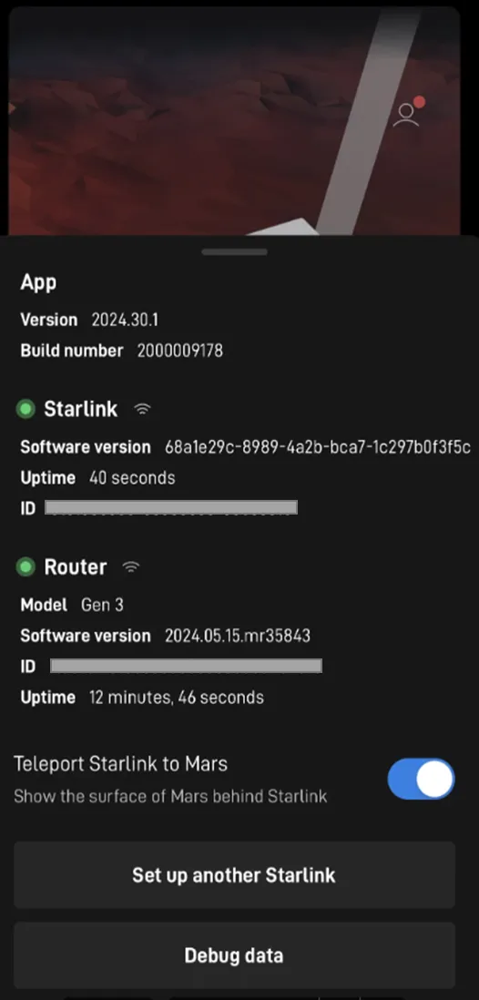
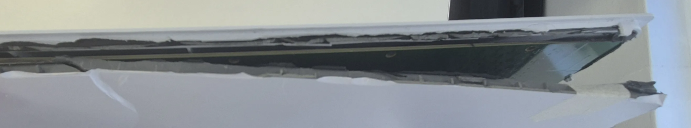
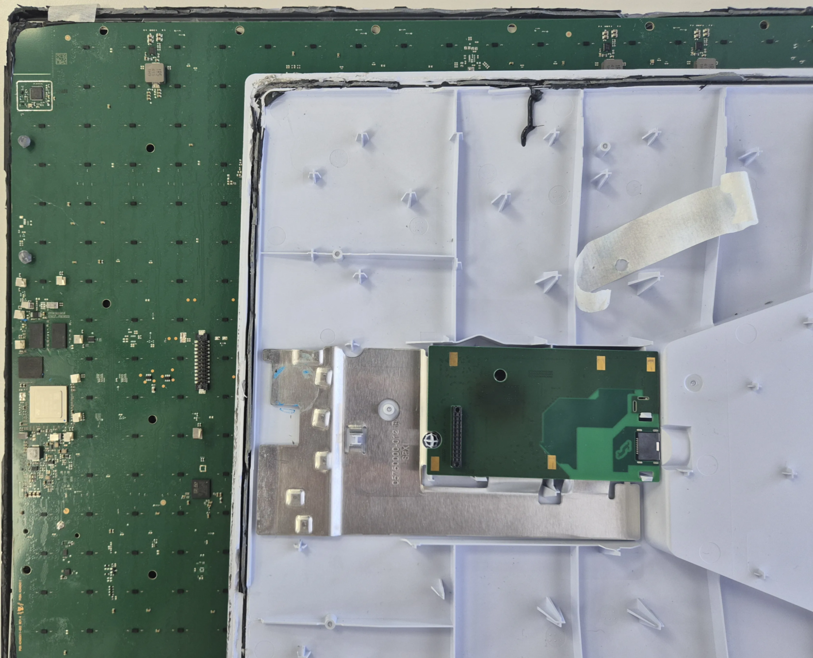
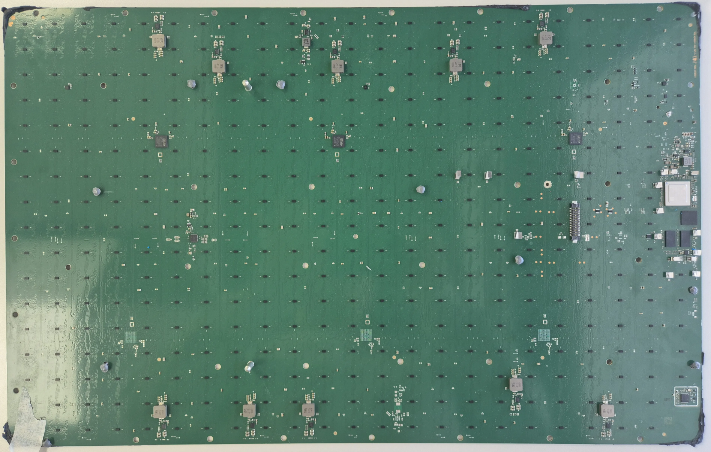
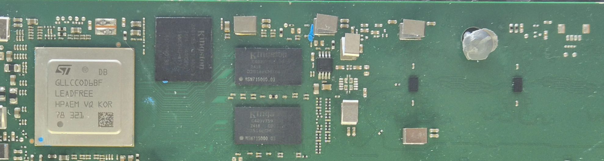
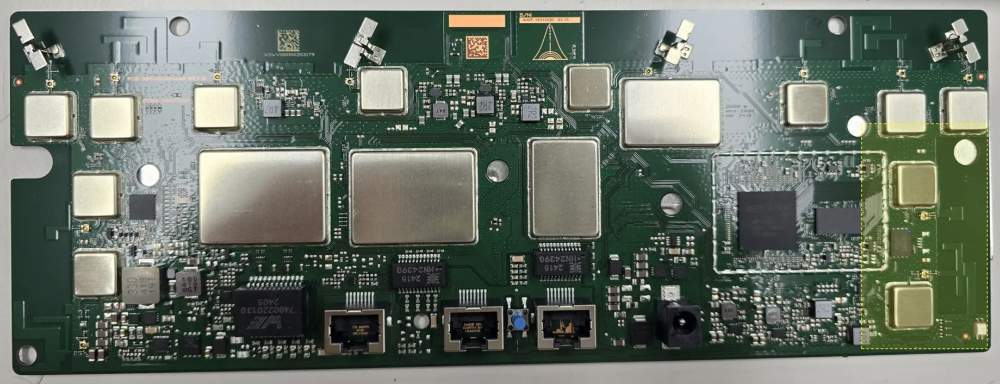
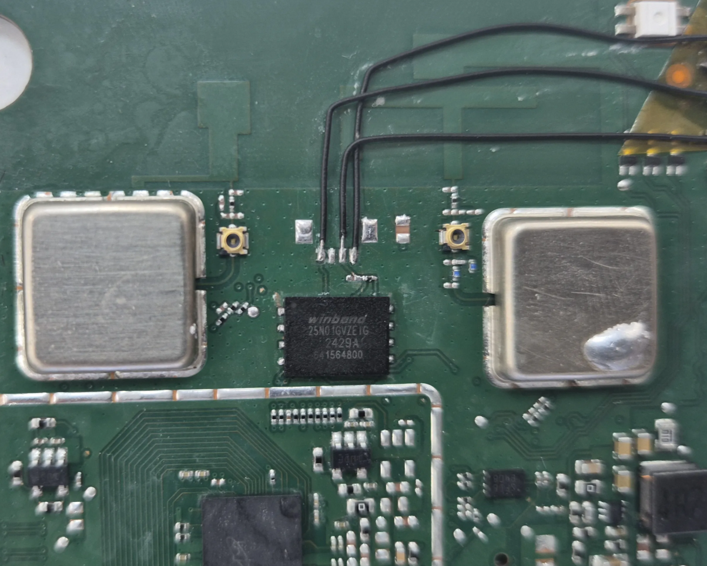
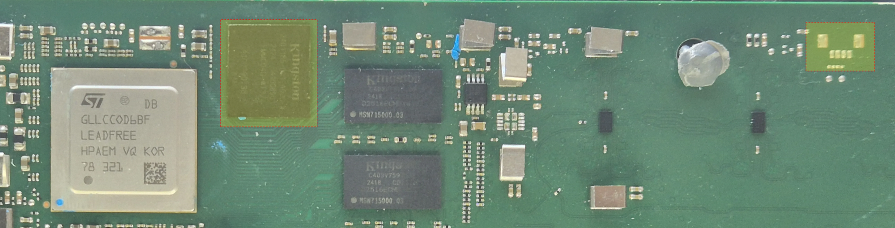

# Standard(V4&Gen3)

# 1. TearDown & Firmware Extracting

## 1.1. TearDown

1. 목적
    - 스타링크 최신 기기는 V4(안테나) Gen3(라우터)로 구성되어 있고 V4와 Gen3의 Teardown 과정을 공유한다.
2. 작업과정
    1. 스타링크 V4의 구성품
        - 전체 구성품
            
            
                        
        - V4 DISHY
            
            
            
        - Gen 3 ROUTER
            
            
            
        - Cable(POE), Adapter, Power
            
            
            
    2. 연결 방법
        - 전체 연결 방법은 아래 그림과 같다.
            
            
            

1. 동작 확인
    - 정상 동작을 확인할 수 있다.
        
        
        
2. Teardown 과정
    - 케이스 분리를 위해서는 면을 제거해야 한다.
    - 헤라와 고무망치로 케이스를 뜯어서 PCB와 분리 시킨다.
        
        
        
    - V4 DISHY 먼저 분해, 헤라를 이용해서 실리콘을 제거하면서 분리한다.
        
        
        
    - 아래 사진과 같이 PCB를 볼 수 있다.
        
        
        
    - SoC, RAM, and eMMC등으로 구성되어 있다.
        
        
        
    - 통합 이미지
        
        
        
    - Gen3 Router 분해
        
        Dishy와 동일하게 사면 모두 헤라로 실리콘을 제거하며 분리한다.
        
        
        

## 1.2. V4/Gen3 UART & Firmware Extracting 

1. 목적
    - V4/Gen3 Firmware Extracting 과정에 대한 내용을 공유한다.
    - UART 위치 확인한다.
2. Gen3 Router
    1. PCB Layout
        - Firmware Extracting하기 위해 NandFlash와 UART를 확인한다.
            
            
            
            
            
    2. 유의 사항
        - 가운데 그라운드가 넓게 되어있어 Chip Off 시 유의한다.
        - UART는 아래의 그림으로 유추 확인 할 수 있다.
            
            RX로 추정되는 신호는 2개이다.  단 Vcc는 없다.
            
            
            
    3. Firmware 추출 방법
        - BeeProg2 장비 사용하여 NandFlash를 Chip Off 하여 Tool을 이용해 Dump를 수행한다.
            
            
            

3. V4 DISHY

- eMMC가 ball type 이라 D0, CMD, CLK 등의 TP가 없어  Chip Off를 수행한다.
- eMMC Chip Off 후 JIG에 연결하고 Linux에서  dd 명령어로 Dump 수행한다.
1. PCB Layout
    - 노란박스 eMMC - **EMMC04G-WT32-01G10 (Kingston Techn.) - 4gb**
        
        
        
        
        
2. 유의 사항
    - PCB상의 GND가 넓어 chip off 시 오랫동안 열풍기에 노출 시켜야 한다.
    - Chip Damage를 고려하여 작업을 해야 한다.
    - UART는 아래의 그림을 유추 확인 할 수 있다.
        
        GND 이외의 신호가 나오지 않는다.
        
        
        
3. Firmware 추출방법
    - eMMC SD Reader에 연결해서 데이터를 읽을 수 있다.
        
        
        
    - 윈도우 디스크 관리 창에 RAW로 인식이 되며 파일 시스템을 제대로 인식하지 못한다.
    - 리눅스에서 해당 파일 시스템을 인식 시킨 후 아래 명령어로 메모리 Dump를 수행한다.
        
        ```bash
        fdisk -l
        dd if=/dev/sdb of=./v4_img.bin bs=512
        ```
        

# 2. Resolve the issue

## 2.1. Gen3 NanFlash Repair

1. 문제점
    - pin2pwn test 중에 NandFlash의 데이터가 깨져 부팅이 안되는 현상이 발생했다.
    - 부품을 교체하여 Gen3를 수리한다.

1.  진행방법
    1. 부품 확인 및 부품 chipoff
        - 빨간 박스의 NandFlash를 Chipoff 하고 새로운 Chip으로 교체한다.
            
            
            
    2. 부품 구매
        - 디바이스XX에서 아래 부품을 구매한다.
        - FlashMemory 사양은 다음과 같다.
            - IC FLASH 1GBIT SPI/QUAD 8WSON / Digi-Key Part Number : 256-W25N01GVZEIG-ND
            
            
            
    3. JIG 보드 확인
        - Flash read / Write를 위한 Jig 보드 및 장비를 확인한다.
        - BeeProg2 에서 Device가 지원되는지 확인한다. -  W25N01GVZE 검색
            
            
            
2. 결론
    - 부팅시 로그를 확인하여 기존에 문제가 발생했던 부분이 문제 없이 넘어가는 것을 확인했고 라우터가 정상적으로 인식되는 것을 확인 했다.
        
        
