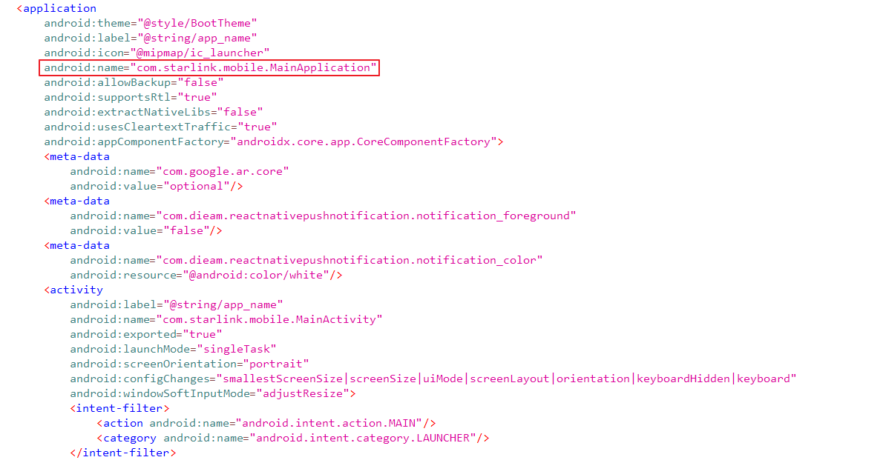
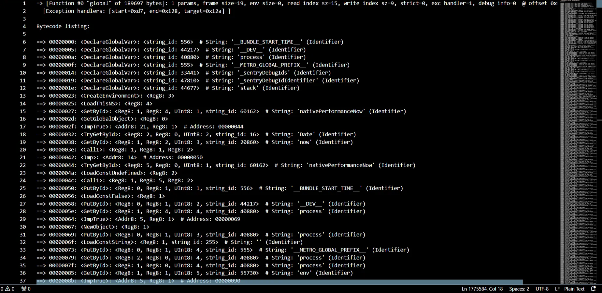
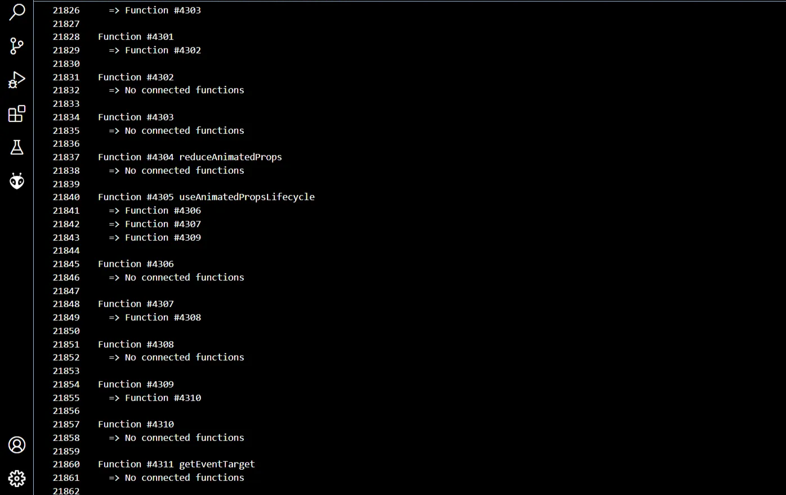

# Mobile App

# 1. 개요

본 연구는 Starlink 구조를 기반으로 모바일 애플리케이션의 ROUTER 환경 설정 및 DISHY와의 통신 기능 등을 분석하여 잠재적 공격 시나리오를 도출하고 이를 검증하는 것을 목적으로 한다.


# 2. 정적 분석

## 2.1. Android

Android 애플리케이션 패키지(APK) 파일은 **ADB(Android Debug Bridge)** 명령어를 통해 직접 추출하거나 APK 추출 앱을 이용하여 확보할 수 있다. 추출된 APK 파일은 **JEB** 또는 **Jadx**와 같은 디컴파일 도구를 활용하여 분석할 수 있으며, 본 연구에서는 **Jadx**를 사용하여 앱을 분석하였다.

### **2.1.1. APK 구성 요소 분석**

```jsx
base/.
├── AndroidManifest.xml
├── META-INF
├── assets
│   ├── index.android.bundle
│   └── sw_update.sxv
├── barcode-scanning-common.properties
├── barcode-scanning.properties
├── classes.dex
├── classes2.dex
├── classes3.dex
├── classes4.dex
├── classes5.dex
├── client_analytics.proto
├── common.properties
├── core-common.properties
├── firebase-analytics.properties
├── firebase-annotations.properties
├── firebase-auth-interop.properties
├── firebase-encoders-proto.properties
├── firebase-encoders.properties
├── firebase-iid-interop.properties
├── firebase-iid.properties
├── firebase-measurement-connector.properties
├── image.properties
├── kotlin
├── kotlin-tooling-metadata.json
├── messaging_event.proto
├── messaging_event_extension.proto
├── okhttp3
├── org
├── play-services-ads-identifier.properties
├── play-services-auth-api-phone.properties
├── play-services-auth-base.properties
├── play-services-auth.properties
├── play-services-base.properties
├── play-services-basement.properties
├── play-services-cloud-messaging.properties
├── play-services-fido.properties
├── play-services-location.properties
├── play-services-measurement-api.properties
├── play-services-measurement-base.properties
├── play-services-measurement-impl.properties
├── play-services-measurement-sdk-api.properties
├── play-services-measurement-sdk.properties
├── play-services-measurement.properties
├── play-services-mlkit-barcode-scanning.properties
├── play-services-stats.properties
├── play-services-tasks.properties
├── res
├── resources.arsc
├── review-ktx.properties
├── review.properties
├── stamp-cert-sha256
├── vision-common.properties
└── vision-interfaces.properties

```

- **`AndroidManifest.xml`**
- **`/google/protobuf`**: gRPC 통신에 사용되는 proto 파일이 포함되어 있다.
- **`/asset`**: `sw_update.sxv` 파일과 `index.android.bundle` 파일이 존재하며, `sw_update.sxv` 파일은 DISHY에서 사용되는 펌웨어로 분석되었다.
- **`split_config.arm64_v8a.apk`** :압축 해제 시 **`/lib/arm64-v8a`** 폴더에 so 라이브러리 파일들이 존재하며, 일반적이지 않은 형식으로 구성되어 있다.

### **2.1.2. Jadx를 통한 분석**

아래는 **`com.starlink.mobile`** 패키지의 주요 코드 분석 결과이다.



`<application>` 태그의 이름과 `<activity>`의 이름이 모두 **`com.starlink.mobile`** 패키지로 설정이 되어있다. 앱의 주요 기능은 **`com.starlink`** 패키지에 있을 것으로 추정되었으나, 실제 존재하는 패키지는 4개이다.


앱의 페이지 수와 기능에 비해 분석된 패키지 수가 부족하여, `base.apk` 에 모든 함수가 구현되지 않았고 다른 파일에서 추가적인 함수를 불러올 가능성이 의심되었다.

특히, **`com.starlink.mobile.MainApplication`** 모듈에서 `this.isHermesEnabled = true;`로 설정된 부분을 통해 Hermes 번들인 `index.android.bundle` 내부에 분석되지 않은 숨겨진 함수가 존재할 것으로 예상된다.

## 2.2. iOS

iOS 앱 분석은 탈옥된 디바이스에서 **frida-ios-dump**를 활용하여 decrypted 된 IPA 파일을 추출한 뒤 진행되었다.

```bash
// ipa 추출 코드
git clone https://github.com/AloneMonkey/frida-ios-dump.git
cd frida-ios-dump

pip install -r requirements.txt --upgrade
python dump.py com.starlink.mobile
```

### **2.2.1. IPA 구성 요소 분석**

```jsx
Payload/.
├── Assets.car
├── EXConstants.bundle
├── ExpoApplication_privacy.bundle
├── ExpoConstants_privacy.bundle
├── ExpoDevice_privacy.bundle
├── ExpoFileSystem_privacy.bundle
├── ExpoLocalization_privacy.bundle
├── FBLPromises_Privacy.bundle
├── FirebaseABTesting_Privacy.bundle
├── FirebaseCoreExtension_Privacy.bundle
├── FirebaseCoreInternal_Privacy.bundle
├── FirebaseCore_Privacy.bundle
├── FirebaseCrashlytics_Privacy.bundle
├── FirebaseInstallations_Privacy.bundle
├── FirebaseRemoteConfig_Privacy.bundle
├── Frameworks
│   ├── MapboxCommon.framework
│   ├── MapboxCoreMaps.framework
│   ├── MapboxMaps.framework
│   ├── MapboxMobileEvents.framework
│   ├── Turf.framework
│   ├── ViroKit.framework
│   ├── hermes.framework
│   └── libswift_Concurrency.dylib
├── GTMSessionFetcher_Core_Privacy.bundle
├── GoogleDataTransport_Privacy.bundle
├── GoogleService-Info.plist
├── GoogleUtilities_Privacy.bundle
├── Info.plist
├── LaunchScreen.storyboardc
├── PkgInfo
├── PrivacyInfo.xcprivacy
├── Promises_Privacy.bundle
├── RCTI18nStrings.bundle
├── RNCAsyncStorage_resources.bundle
├── SC_Info
├── Sentry.bundle
├── Starlink
├── _CodeSignature
│   └── CodeResources
├── assets
│   ├── app
│   └── node_modules
├── main.jsbundle
├── modules.json
├── nanopb_Privacy.bundle
├── ROUTER_ca_cert.der
└── sw_update.sxv
```
- `/Frameworks`
- 큰 순서대로 정렬하면 sw_update.sxv 파일과 main.jsbundle 파일, Starlink 파일이 있다. Starlink는 IDA로 열어보면 분석할 수 있는 메인 바이너리 파일이다. main.jsbundle은 위의 index.android.bundle과 같이 ios 용 Hermes 번들이다.


## 2.3. Hermes Bundle

APK와 IPA 모두에서 **Hermes VM** 바이트코드로 컴파일된 번들 파일(`index.android.bundle`, `main.jsbundle`)이 확인되었다. 이러한 파일은 일반적인 디컴파일 도구로는 분석이 어려우며, 별도의 Hermes 디스어셈블러가 필요하다.

### **2.3.1. App 버전 별 사용 Hermes 디스어셈블 툴**

- 2024.30.0 버전에서의 Hermes Bundle 96버전: 2024.9.4 분석 시 P1sec/hermes-dec 사용
- 2024.39.0 버전에서의 Hermes Bundle 96버전: 2024.10.4 공개된 hermes_rs 사용

### **2.3.2. hermes-dec을 사용한 Hermes Bundle 디스어셈블**

**P1sec**이 개발한 [**hermes-dec**](https://github.com/P1sec/hermes-dec/tree/main)이며 2023년도에 95버전까지 지원할 수 있도록 업데이트를  하였다. **hermes-dec** 도구를 이용하여 Hermes 번들을 디스어셈블하고, 함수들의 연결 관계를 분석하였다. 사용 방법은 아래와 같다.

```bash
# hermes-dec 설치
sudo apt install -y python3-pip
sudo pip3 install --upgrade git+https://github.com/P1sec/hermes-dec
sudo apt install python3-clang-12

# main.jsbundle 이 있는 디렉터리로 이동
hbc-file-parser main.jsbundle > parse_his_ios
hbc-disassembler main.jsbundle ./my_output_file.hasm
```

my_output_file.hasm 파일을 열어 hermes assembly를 볼 수 있게 되었다.



### **2.3.3. Hermes 함수 파싱 및 시각화**

main.jsbundle에서 풀어낸 코드만해도 410만줄이 넘는다. 그렇기에 파이썬 코드를 작성하여 함수 이름과 안에서 호출되는 함수들을 파싱하여 텍스트 파일로 만들었다.

*hermes-dec로 추출된 hasm의 형식에 맞춘 스크립트이다.*

간단하게 정규 표현식을 사용하여 함수 이름과 연결된 함수를 구분할 수 있다. 함수들을 나누는 패턴을 사용하여 함수를 분류하였다.

```python
# Regular expression to match main function definitions
function_pattern = re.compile(r'\[Function #(\d+) "(.*?)" of \d+ bytes\]')

# Regular expression to match all connected functions within the bytecode
connected_function_pattern = re.compile(r'# Function: \[#(\d+)')

# Split the content into individual function sections by the "==============" divider
function_sections = file_content.split('===============\n')
```

스크립트를 실행시키면 아래와 같은 텍스트 파일이 생성된다.



이제 함수들의 플로우를 **graphviz**로 시각화하였다. 아래는 예시 함수이다.

```python
# Recursive function to create a flow diagram for a function and its connections
def create_function_flow_graph(func_num, functions, graph, visited):
    if func_num in visited:
        return
    visited.add(func_num)

    function_name = functions[func_num]["name"]
    graph.node(func_num, f"Function #{func_num}\n{function_name}")

    # Draw edges to connected functions
    for connected_func in functions[func_num]["connections"]:
        connected_name = functions[connected_func]["name"]
        graph.node(connected_func, f"Function #{connected_func}\n{connected_name}")
        graph.edge(func_num, connected_func)
        # Recursively process connected functions
        create_function_flow_graph(connected_func, functions, graph, visited)
```


### **2.3.4. [hermes_rs](https://github.com/Pilfer/hermes_rs?tab=readme-ov-file)을 사용한 Hermes Bundle 디스어셈블 및 스크립트 추출**


```bash
# Rust관련 도구 설치
curl --proto '=https' --tlsv1.2 -sSf <https://sh.rustup.rs> | sh

# 환경 가져오기
# 이곳에 추출할 hermes번들파일 놓기
git clone <https://github.com/Pilfer/hermes_rs.git>
cd hermes_rs

# 아래의 코드를 참조하여 메인코드 수정
vi src/main.rs

# 실행(실행할 바이너리 지정)
cargo run --bin hermes_rs

```

**디스어셈블 메인 코드**

```rust
use std::fs::File;
use std::io::BufReader;
use hermes_rs::hermes_file::HermesFile;

fn main() {
    let filename = "./index.android.bundle";

    let f = File::open(filename).expect("no file found");
    let mut reader = BufReader::new(f);

    let hermes_file = HermesFile::deserialize(&mut reader);
    
    **//choose one from below (1~6)**
    **// 1) 파일 header 읽기**
    println!("{:?}", hermes_file.header);
    
    **// 2) 문자열 읽기**
    println!("Strings: {:?}", hermes_file.get_strings());
    
    **// 3) 함수 header 읽기**
    for func in hermes_file.function_headers {
    println!("{:?}", func);
    }
    
    **// 4) bytecode dumping**
    hermes_file.parse_bytecode_for_fn(255);
    
    **// 5) 전체 bytecode**
    hermes_file.print_bytecode();
    
    **// 6) Raw byte**
    for func in bc {
        println!("{:?}", func);
    }
}
```

# 3. 동적 분석

*분석 전 SSL Pinning 우회해야 Burpsuite 같은 프록시 도구를 사용하기 편하다.*

## 3.1. 통신

앱에서 로그인을 하지 않으면 ROUTER 설정을 할 수 없다. 사용 가능한 기능들은 ROUTER reboot, DISHY reboot, speed test 등이 있다. 이런 기능들은 **gRPC**를 활용하여 ROUTER와 DISHY 간 통신을 수행하며, 주요 통신 대상은 다음과 같다:

- **ROUTER**: `192.168.1.1:9001`
- **DISHY**: `192.168.100.1:9201`

gRPC 부분은 Wireshark로 확인이 가능하고, Burpsuite로도 확인이 가능하다. gRPC에 대하여 [gRPC](https://www.notion.so/gRPC-6ef4f092cc1943cf86ac4857010dbda7?pvs=21) 페이지에 자세하게 설명이 되어있다. 아래는 Wireshark에서 캡쳐한 gRPC-Web 통신이다.


*[192.168.1.29 → 모바일 앱, 192.168.1.25 → 노트북 프록시]*

로그인은 스타링크 웹페이지의 API(api.starlink.com)를 이용한다. 웹에서 로그인이 완료되면 JWT 토큰을 발급해주며, 앱은 JWT 토큰과 Refresh 토큰을 기기에 저장한다. 

**JWT 토큰 분석**

```bash
HEADER:ALGORITHM & TOKEN TYPE
{
  "alg": "RS384",
  "typ": "at+jwt"
}
PAYLOAD:DATA
{
  "iss": "https://api.starlink.com/auth",
  "nbf": 1727756507,
  "iat": 1727756507,
  "exp": 1727757407,
  "aud": "starlink_consumer_apps",
  "scope": [
    "openid",
    "group",
    "email",
    "api",
    "profile",
    "offline_access"
  ],
  "amr": [
    "pwd"
  ],
  "client_id": "mobileAppClientId",
  "sub": "########",
  "auth_time": 1727753322,
  "idp": "local",
  "role": "[1001]",
  "account_id": "ACC-######",
  "can_manage_clients": "False",
  "mfa": "1727753322",
  "sid": "7C8410DF7E87D724FD05C2D369020344",
  "jti": "F28143B12B7A6E9A67ADE6FF2D51F357"
}
VERIFY SIGNATURE
RSASHA384(
  base64UrlEncode(header) + "." +
  base64UrlEncode(payload),
Public_key,
Private_key
)
```

로그인 후 ROUTER 환경 설정 때에는 바로 ROUTER와 DISHY로 가지 않고 [api2.starlink.com](http://api2.starlink.com) 이라는 API를 통한다. 로그인 토큰 값이 존재하지 않으면 API를 사용할 수 없다. API가 모바일 앱에서 보낸 설정을 DISHY와 ROUTER로 보내주는 부분은 암호화가 되어있어 내용을 복호화하지 못했다. 


*[Burpsuite, 모바일 앱 → API]*

위에 분석한 것과 같이 앱의 통신 부분은 아래의 그림으로 정리할 수 있다.


## 3.2. Hermes Byte Code 동적 디버깅 시도

Hermes Bundle 분석을 통하여 내부에 중요해 보이는 함수들이 많이 존재한다는 것을 확인하였다. 그 중에 sideload라는 기능을 찾아서 펌웨어 다운로드가 가능한지 시도하기 위해 Hermes Bundle 내부에 있는 함수에 frida로 후킹하는 방법을 연구하였다.

*전체적인 시도는 Android와 iOS가 동일하다. frida version : 16.5.1, Python 3.9.9*

### 3.2.1. Hermes 함수 후킹을 위한 다양한 접근 방식

처음 시나리오는 화면에 출력되는 텍스트를 후킹 후 백트레이스를 하면 텍스트를 불러온 초기 함수를 찾을 수 있을 것이라고 추측했다. 간단한 frida 코드를 작성하여 백트레이스 로그를 출력해보았다.

**화면 출력 후킹 및 백트레이스**

[예시_1 : Android ] 

```jsx
Java.use('android.widget.TextView').setText.overload('java.lang.CharSequence').implementation = function (stringArgument) {
    console.error("c'tor",stringArgument);
    console.error(Java.use("android.util.Log").getStackTraceString(Java.use("java.lang.Exception").$new()));
    var result = this.setText(stringArgument);
    console.log("setText", result, stringArgument);
    return result;
};

Java.use('com.facebook.react.views.text.ReactTextView').setText.overload('com.facebook.react.views.text.ReactTextUpdate').implementation = function(stringArgument){
    console.error("c'tor 2",stringArgument);
    console.error(Java.use("android.util.Log").getStackTraceString(Java.use("java.lang.Exception").$new()));
    var result = this.setText(stringArgument);
    console.log("setText", result, stringArgument);
    return result;
}
```

위의 스크립트를 실행시키면 아래 로그와 같이 나온다. sideload 기능이 존재하는 페이지에 쓰여있는 텍스트 중 하나를 따라 올라가면 UI(`com.facebook.react.uimanager`)쪽을 지나 main에서 출발한 것을 확인할 수 있다. Hermes 함수에서 출발하였다는 의심이 드는 함수들이 보이지 않는다.

```jsx
c'tor The software version available in the Starlink app is older than the current version installed on your user terminal. 
Please update your Starlink app to ensure you have the latest version available.
java.lang.Exception
        at android.widget.TextView.setText(Native Method)
        at com.facebook.react.views.text.ReactTextView.setText(ReactTextView.java:371)
        at com.facebook.react.views.text.ReactTextViewManager.updateExtraData(ReactTextViewManager.java:94)
        at com.facebook.react.views.text.ReactTextViewManager.updateExtraData(ReactTextViewManager.java:38)
        at com.facebook.react.uimanager.NativeViewHierarchyManager.updateViewExtraData(NativeViewHierarchyManager.java:157)
        at com.facebook.react.uimanager.UIViewOperationQueue$UpdateViewExtraData.execute(UIViewOperationQueue.java:214)
        at com.facebook.react.uimanager.UIViewOperationQueue$1.run(UIViewOperationQueue.java:910)
        at com.facebook.react.uimanager.UIViewOperationQueue.flushPendingBatches(UIViewOperationQueue.java:1023)
        at com.facebook.react.uimanager.UIViewOperationQueue.-$$Nest$mflushPendingBatches(Unknown Source:0)
        at com.facebook.react.uimanager.UIViewOperationQueue$DispatchUIFrameCallback.doFrameGuarded(UIViewOperationQueue.java:1083)
        at com.facebook.react.uimanager.GuardedFrameCallback.doFrame(GuardedFrameCallback.java:29)
        at com.facebook.react.modules.core.ReactChoreographer$1.doFrame(ReactChoreographer.java:89)
        at android.view.Choreographer$CallbackRecord.run(Choreographer.java:947)
        at android.view.Choreographer.doCallbacks(Choreographer.java:761)
        at android.view.Choreographer.doFrame(Choreographer.java:693)
        at android.view.Choreographer$FrameDisplayEventReceiver.run(Choreographer.java:935)
        at android.os.Handler.handleCallback(Handler.java:873)
        at android.os.Handler.dispatchMessage(Handler.java:99)
        at android.os.Looper.loop(Looper.java:214)
        at android.app.ActivityThread.main(ActivityThread.java:7050)
        at java.lang.reflect.Method.invoke(Native Method)
        at com.android.internal.os.RuntimeInit$MethodAndArgsCaller.run(RuntimeInit.java:494)
        at com.android.internal.os.ZygoteInit.main(ZygoteInit.java:964)
```

**메모리 스캔 및 패치 시도**

`libc.so` 에 있는 `memcmp`로 펌웨어 버전을 비교하는 부분이 존재하는 지 확인해봤다. 펌웨어 버전은 1710193075와 같은 형식이 아닌 중간에 0x00으로 나눠져 있다.

[예시_2: Android]

```jsx
onEnter: function (args) {
        const size = args[2].toInt32();
        this.mem1 = args[0].readByteArray(size);
        this.mem2 = args[1].readByteArray(size);

        const pattern = [0x31, 0x00, 0x37, 0x00, 0x31, 0x00, 0x30, 0x00, 0x31,0x00,0x39,0x00, 0x33, 0x00, 0x30, 0x00, 0x37, 0x00, 0x35, 0x00];
        const isMatch = (arrayBuffer, pattern) => {
            if (arrayBuffer.byteLength !== pattern.length) return false;
            const view = new Uint8Array(arrayBuffer);
            return pattern.every((byte, index) => view[index] === byte);
        };

        if (isMatch(this.mem1, pattern) || isMatch(this.mem2, pattern)) {
            console.log("memcmp called with matching pattern:", pattern);

            // Log a backtrace
            console.log("Backtrace:");
            console.log(Thread.backtrace(this.context, Backtracer.FUZZY)
                .map(DebugSymbol.fromAddress)
                .join("\n"));
        }
}
```

원하는 패턴을 비교하는 부분을 찾았으나, DISHY의 현재 펌웨어 버전과 APP 내부의 펌웨어 파일 버전을 비교하는 부분은 없었다. 아래의 로그가 어떤 부분인지 확인하기 위해 메모리 패치를 시도했다.

```jsx
memcmp called with byte arrays:
          0  1  2  3  4  5  6  7  8  9  A  B  C  D  E  F  0123456789ABCDEF
00000000  31 00 37 00 31 00 30 00 31 00 39 00 33 00 30 00  1.7.1.0.1.9.3.0.
00000010  37 00 35 00                                      7.5. 
          0  1  2  3  4  5  6  7  8  9  A  B  C  D  E  F  0123456789ABCDEF
00000000  31 00 37 00 31 00 30 00 31 00 39 00 33 00 30 00  1.7.1.0.1.9.3.0.
00000010  37 00 35 00                                      7.5. 
of size   20
```

**네이티브 함수 출력**

[예시_3: Android]

이 스크립트는 IDA나 Ghidra가 없는 상황에서 네이티브 함수들의 이름과 주소를 알고 싶을 때 사용하는 용도이다. so 파일에 따라 로딩되는 시간이 존재하여 500의 setTimeout을 주었다.

```jsx
setTimeout(function () {
Java.perform(function() {
    const modules = Process.enumerateModules();

    modules.forEach(function(module) {
        console.log("Module Name:", module.name);
        console.log("Base Address:", module.base, " | Size:", module.size);

        try {
            const exports = Module.enumerateExports(module.name);
            
            exports.forEach(function(exp) {
                if (exp.type === "function") {
                    console.log("    Function name:", exp.name, "| Address:", exp.address);
                }
            });
        } catch (e) {
            console.log("    Error accessing exports for module:", module.name);
            console.log("    Error:", e.message);
        }

        console.log("\n");
    });
});
},500);
```

아래와 같이 심볼이 살아있는 함수들의 이름과 주소를 출력할 수 있다.

```jsx
[SM N935S::com.starlink.mobile ]-> Module Name: app_process64
Base Address: 0x784e96d000  | Size: 204800
    Function name: AddSpecialSignalHandlerFn | Address: 0x784e97ab48
    Function name: sigaction | Address: 0x784e97a400
    Function name: sigaction64 | Address: 0x784e97a5c8
    Function name: sigprocmask | Address: 0x784e97a8c8
    Function name: sigprocmask64 | Address: 0x784e97aaa0
    Function name: signal | Address: 0x784e97a748
    Function name: RemoveSpecialSignalHandlerFn | Address: 0x784e97acb8
    Function name: EnsureFrontOfChain | Address: 0x784e97adc8

.......
.......

Module Name: libhermes.so
Base Address: 0x77a70a3000  | Size: 2138112
    Function name: _ZN8facebook6hermes13HermesRuntime22unregisterForProfilingEv | Address: 0x77a712be0c
    Function name: _ZN6hermes2vm18JSOutOfMemoryErrorD0Ev | Address: 0x77a7225c88
    Function name: _ZN8facebook6hermes13HermesRuntime18getBytecodeVersionEv | Address: 0x77a712ac64
    Function name: _ZN8facebook6hermes13HermesRuntime14watchTimeLimitEj | Address: 0x77a712be64
    Function name: _ZN6hermes2vm17GCTripwireContextD2Ev | Address: 0x77a7225c50
    Function name: _ZN6hermes2vm15NopCrashManager16unregisterMemoryEPv | Address: 0x77a7225cb0
    Function name: _ZN6hermes2vm15NopCrashManagerD1Ev | Address: 0x77a7225c58
    Function name: _ZN6hermes2vm15NopCrashManager11setHeapInfoERKNS0_12CrashManager15HeapInformationE | Address: 0x77a7225cd0
    Function name: _ZN8facebook6hermes13HermesRuntime11loadSegmentENSt6__ndk110unique_ptrIKNS_3jsi6BufferENS2_14default_deleteIS6_EEEERKNS4_5ValueE | Address: 0x77a712b2f0
    Function name: _ZN6hermes2vm15NopCrashManager16removeCustomDataEPKc | Address: 0x77a7225cb8
    Function name: _ZN8facebook6hermes13HermesRuntime22enableSamplingProfilerEv | Address: 0x77a712ac78
    Function name: _ZN8facebook6hermes13HermesRuntime26enableCodeCoverageProfilerEv | Address: 0x77a712b2c8
    Function name: _ZN8facebook3jsi7Runtime12PointerValueD2Ev | Address: 0x77a7134110
    Function name: _ZN6hermes2vm17GCTripwireContextD1Ev | Address: 0x77a7225c50
    Function name: _ZN8facebook6hermes13HermesRuntime22prefetchHermesBytecodeEPKhm | Address: 0x77a712ac6c
    Function name: _ZNK8facebook6hermes13HermesRuntime11getUniqueIDERKNS_3jsi10PropNameIDE | Address: 0x77a712badc
    Function name: _ZN8facebook6hermes27hardenedHermesRuntimeConfigEv | Address: 0x77a7131cac
    Function name: _ZNSt6__ndk113random_deviceC2Ev | Address: 0x77a7143d9c
.......
.......
```

**`com.facebook.react.bridge.CatalystInstanceImpl` 트레이스**

[예시_4: Android]

`com.facebook.react.bridge.CatalystInstanceImpl`는 React Native에서 JavaScript와 Native code 간의 브리지 역할을 수행하며, 두 환경 간의 메서드 호출을 관리하는 핵심 클래스이다. 

```jsx
setTimeout(function () {
    const second = Java.use('com.facebook.react.bridge.CatalystInstanceImpl');
    second.jniCallJSFunction.implementation = function (module, method, args) {
        if (module !== "JSTimers") {
            console.log("module", module);
            console.log("method", method);
            console.log("argument", args);
            console.log(Java.use("android.util.Log").getStackTraceString(Java.use("java.lang.Exception").$new()));
        }
    this.jniCallJSFunction(module, method, args);

    };
    console.log("jniCallJSFunction hook applied after 100ms delay");
}, 1000);
```

로그에서의 예시와 같이 앱의 네트워크 통신 메서드와 스크린 조작 메서드를 확인할 수 있다. 하지만 Hermes Bundle 내부의 함수는 아니다.

```jsx
module RCTDeviceEventEmitter
method emit
argument ["didReceiveNetworkResponse",[1547,200,{"access-control-expose-headers":"Content-Type, Vary, Date, grpc-status, grpc-message","content-type":"application/grpc-web+proto","vary":"Origin"},"https://192.168.1.1:9006/SpaceX.API.Device.Device/Handle"]]
java.lang.Exception
	at com.facebook.react.bridge.CatalystInstanceImpl.jniCallJSFunction(Native Method)
	at com.facebook.react.bridge.CatalystInstanceImpl.-$$Nest$mjniCallJSFunction(Unknown Source:0)
	at com.facebook.react.bridge.CatalystInstanceImpl$PendingJSCall.call(CatalystInstanceImpl.java:68)
	at com.facebook.react.bridge.CatalystInstanceImpl.callFunction(CatalystInstanceImpl.java:317)
	at com.facebook.react.bridge.CatalystInstanceImpl.callFunction(CatalystInstanceImpl.java:299)
	at com.facebook.react.bridge.JavaScriptModuleRegistry$JavaScriptModuleInvocationHandler.invoke(JavaScriptModuleRegistry.java:84)
	at java.lang.reflect.Proxy.invoke(Proxy.java:1006)
	at $Proxy6.emit(Unknown Source)
	at com.facebook.react.bridge.ReactContext.emitDeviceEvent(ReactContext.java:233)
	at com.facebook.react.modules.network.ResponseUtil.onResponseReceived(ResponseUtil.java:120)
	at com.facebook.react.modules.network.NetworkingModule$2.onResponse(NetworkingModule.java:480)
	at okhttp3.internal.connection.RealCall$AsyncCall.run(RealCall.kt:519)
	at java.util.concurrent.ThreadPoolExecutor.runWorker(ThreadPoolExecutor.java:1167)
	at java.util.concurrent.ThreadPoolExecutor$Worker.run(ThreadPoolExecutor.java:641)
	at java.lang.Thread.run(Thread.java:764)

module RCTDeviceEventEmitter
method emit
argument ["didReceiveNetworkDataProgress",[1546,387,-1]]
module RCTDeviceEventEmitter
method emit
argument ["didReceiveNetworkDataProgress",[1547,3065,-1]]
java.lang.Exception
	at com.facebook.react.bridge.CatalystInstanceImpl.jniCallJSFunction(Native Method)
	at com.facebook.react.bridge.CatalystInstanceImpl.-$$Nest$mjniCallJSFunction(Unknown Source:0)
	at com.facebook.react.bridge.CatalystInstanceImpl$PendingJSCall.call(CatalystInstanceImpl.java:68)
	at com.facebook.react.bridge.CatalystInstanceImpl.callFunction(CatalystInstanceImpl.java:317)
	at com.facebook.react.bridge.CatalystInstanceImpl.callFunction(CatalystInstanceImpl.java:299)
	at com.facebook.react.bridge.JavaScriptModuleRegistry$JavaScriptModuleInvocationHandler.invoke(JavaScriptModuleRegistry.java:84)
	at java.lang.reflect.Proxy.invoke(Proxy.java:1006)
	at $Proxy6.emit(Unknown Source)
	at com.facebook.react.bridge.ReactContext.emitDeviceEvent(ReactContext.java:233)
	at com.facebook.react.modules.network.ResponseUtil.onDataReceivedProgress(ResponseUtil.java:55)
	at com.facebook.react.modules.network.NetworkingModule$1.onProgress(NetworkingModule.java:333)
	at com.facebook.react.modules.network.ProgressResponseBody$1.read(ProgressResponseBody.java:62)
	at okio.Buffer.writeAll(Buffer.kt:1290)
	at okio.RealBufferedSource.readByteArray(RealBufferedSource.kt:236)
	at okhttp3.ResponseBody.bytes(ResponseBody.kt:124)
	at com.facebook.react.modules.network.NetworkingModule$2.onResponse(NetworkingModule.java:551)
	at okhttp3.internal.connection.RealCall$AsyncCall.run(RealCall.kt:519)
	at java.util.concurrent.ThreadPoolExecutor.runWorker(ThreadPoolExecutor.java:1167)
	at java.util.concurrent.ThreadPoolExecutor$Worker.run(ThreadPoolExecutor.java:641)
	at java.lang.Thread.run(Thread.java:764)

java.lang.Exception
	at com.facebook.react.bridge.CatalystInstanceImpl.jniCallJSFunction(Native Method)
	at com.facebook.react.bridge.CatalystInstanceImpl.-$$Nest$mjniCallJSFunction(Unknown Source:0)
	at com.facebook.react.bridge.CatalystInstanceImpl$PendingJSCall.call(CatalystInstanceImpl.java:68)
	at com.facebook.react.bridge.CatalystInstanceImpl.callFunction(CatalystInstanceImpl.java:317)
	at com.facebook.react.bridge.CatalystInstanceImpl.callFunction(CatalystInstanceImpl.java:299)
	at com.facebook.react.bridge.JavaScriptModuleRegistry$JavaScriptModuleInvocationHandler.invoke(JavaScriptModuleRegistry.java:84)
	at java.lang.reflect.Proxy.invoke(Proxy.java:1006)
	at $Proxy6.emit(Unknown Source)
	at com.facebook.react.bridge.ReactContext.emitDeviceEvent(ReactContext.java:233)
	at com.facebook.react.modules.network.ResponseUtil.onDataReceivedProgress(ResponseUtil.java:55)
	at com.facebook.react.modules.network.NetworkingModule$1.onProgress(NetworkingModule.java:333)
	at com.facebook.react.modules.network.ProgressResponseBody$1.read(ProgressResponseBody.java:62)
	at okio.Buffer.writeAll(Buffer.kt:1290)
	at okio.RealBufferedSource.readByteArray(RealBufferedSource.kt:236)
	at okhttp3.ResponseBody.bytes(ResponseBody.kt:124)
	at com.facebook.react.modules.network.NetworkingModule$2.onResponse(NetworkingModule.java:551)
	at okhttp3.internal.connection.RealCall$AsyncCall.run(RealCall.kt:519)
	at java.util.concurrent.ThreadPoolExecutor.runWorker(ThreadPoolExecutor.java:1167)
	at java.util.concurrent.ThreadPoolExecutor$Worker.run(ThreadPoolExecutor.java:641)
	at java.lang.Thread.run(Thread.java:764)

module RCTDeviceEventEmitter
method emit
argument ["didReceiveNetworkData",[1546,"AAAAAWkYHKJ94wIKhgEKHHV0MDEwMDAwMDAtMDAwMDAwMDAtMDBkZjE3ODASCnJldjRfcHJvZDMaFDIwMjQuMTAuMjQubXI0NDkyNC4yQMICYMemi7kGejsyZTdkYWNhMS01ZWU0LTRhMmUtOGM4NC1iMmZmMGFiNzdmOGYudXRlcm1fbWFuaWZlc3QucmVsZWFzZRIDCIEJ1T4AAIC/3T4AAIA/4j4FPf/////qPgCFP9i6VEaNPwAAgL+yPw0IARD///////////8Buj8AwD/oB9o/ChABGAEgASgBMAHoPwH4PwKIQAGSQAIIAZpAEQgCHR7ImEE9AAdPQk0AAACAokAaIP///////////wEo////////////AUglUAG4QP///////////wGCQR9Sb3V0ZXItMDEwMDAwMDAwMDAwMDAwMDAwQ0VGNDhGgn0eyD4BiH0ByLsBAYj6AQHIuAIBiPcCAci1AwGI9AMBgAAAABBncnBjLXN0YXR1czogMA0K"]]
module RCTDeviceEventEmitter
method emit
java.lang.Exception
	at com.facebook.react.bridge.CatalystInstanceImpl.jniCallJSFunction(Native Method)
	at com.facebook.react.bridge.CatalystInstanceImpl.-$$Nest$mjniCallJSFunction(Unknown Source:0)
	at com.facebook.react.bridge.CatalystInstanceImpl$PendingJSCall.call(CatalystInstanceImpl.java:68)
	at com.facebook.react.bridge.CatalystInstanceImpl.callFunction(CatalystInstanceImpl.java:317)
	at com.facebook.react.bridge.CatalystInstanceImpl.callFunction(CatalystInstanceImpl.java:299)
	at com.facebook.react.bridge.JavaScriptModuleRegistry$JavaScriptModuleInvocationHandler.invoke(JavaScriptModuleRegistry.java:84)
	at java.lang.reflect.Proxy.invoke(Proxy.java:1006)
	at $Proxy6.emit(Unknown Source)
	at com.facebook.react.bridge.ReactContext.emitDeviceEvent(ReactContext.java:233)
	at com.facebook.react.modules.network.ResponseUtil.onDataReceived(ResponseUtil.java:66)
	at com.facebook.react.modules.network.NetworkingModule$2.onResponse(NetworkingModule.java:553)
	at okhttp3.internal.connection.RealCall$AsyncCall.run(RealCall.kt:519)
	at java.util.concurrent.ThreadPoolExecutor.runWorker(ThreadPoolExecutor.java:1167)
	at java.util.concurrent.ThreadPoolExecutor$Worker.run(ThreadPoolExecutor.java:641)
	at java.lang.Thread.run(Thread.java:764)
```

**`HermesRuntimeImpl::call` 트레이스**

[예시_5: Android]
`HermesRuntimeImpl::call`는 심볼이 없는 함수이다. 함수의 주소를 `libhermes.so` 의 base address에 더하여 후킹 스크립트를 작성하였다. `HermesRuntimeImpl::call`이 불려오기 전에 먼저 `makeHermesRuntime` 함수가 런타임 인스턴스를 만든다. args 타입들은 hermes 공식 github의 코드에서 참고하였다.

```jsx
let func = args[1]; // jsi::Function
let jsThis = args[2]; // jsi::Value
let jsArgs = args[3]; // jsi::Value
let count = args[4]; // size_t count
```

`HermesRuntimeImpl::call` 이 우리가 찾던 Hermes Bundle에서의 함수 실행 부분이다. `libhermes_executor.so` 와 `libhermes.so`, `libreanimated.so` 등 여러 곳에서 호출이 된다. 실행할 함수의 이름을 알아야 어떤 함수가 sideload 함수인지 확인할 수 있다. 하지만 로그와 같이 함수의 주소와 args의 주소만을 확인 할 수 있었다.

```jsx
[SM N935S::Starlink ]-> HermesRuntimeImpl::call intercepted
Function: 0x77c1da0fc0
jsThis: 0x77a5ca0968
jsArgs: 0x77a5ca0978
Count: 0x3
runtimePtr: 0x77a6e8413c
valueToStringAddr: 0x77a8b71438
Backtrace:
0x77a65ed364 libhermes_executor.so!_ZNK8facebook3jsi8Function4callIJRKNSt6__ndk112basic_stringIcNS3_11char_traitsIcEENS3_9allocatorIcEEEESB_NS0_5ValueEEEESC_RNS0_7RuntimeEDpOT_+0xf0
0x77a65ed1c4 libhermes_executor.so!0x2d1c4
0x77a65e3634 libhermes_executor.so!_ZNSt6__ndk110__function6__funcIPFvRKNS_8functionIFvvEEENS2_IFNS_12basic_stringIcNS_11char_traitsIcEENS_9allocatorIcEEEEvEEEENSA_ISG_EESF_EclES6_OSE_+0x80
0x77a65e22ac libhermes_executor.so!_ZN8facebook5react11JSIExecutor21defaultTimeoutInvokerERKNSt6__ndk18functionIFvvEEENS3_IFNS2_12basic_stringIcNS2_11char_traitsIcEENS2_9allocatorIcEEEEvEEE
0x77a65e9ff8 libhermes_executor.so!_ZN8facebook5react11JSIExecutor12callFunctionERKNSt6__ndk112basic_stringIcNS2_11char_traitsIcEENS2_9allocatorIcEEEESA_RKN5folly7dynamicE+0x1dc
0x77a6adc058 libreactnativejni.so!0xcb058
0x77a6aa4198 libreactnativejni.so!0x93198
0x77a8b27b64 libfbjni.so!_ZN8facebook3jni22getHybridDataFromFieldEPKNS0_7JObjectERKNS0_6JFieldIPNS0_6detail8JTypeForINS5_10HybridDataES1_vE11_javaobjectEEE+0x9c
0x77a8b27808 libfbjni.so!_ZN8facebook3jni6detail13MethodWrapperIMNS0_15JNativeRunnableEFvvEXadL_ZNS3_3runEvEES3_vJEE8dispatchENS0_9alias_refIPNS1_8JTypeForINS0_11HybridClassIS3_NS0_9JRunnableEE8JavaPartESA_vE11_javaobjectEEE+0x4c
0x77a8b277f4 libfbjni.so!_ZN8facebook3jni6detail13MethodWrapperIMNS0_15JNativeRunnableEFvvEXadL_ZNS3_3runEvEES3_vJEE8dispatchENS0_9alias_refIPNS1_8JTypeForINS0_11HybridClassIS3_NS0_9JRunnableEE8JavaPartESA_vE11_javaobjectEEE+0x38
0x77a8b277bc libfbjni.so!_ZN8facebook3jni6detail13MethodWrapperIMNS0_15JNativeRunnableEFvvEXadL_ZNS3_3runEvEES3_vJEE8dispatchENS0_9alias_refIPNS1_8JTypeForINS0_11HybridClassIS3_NS0_9JRunnableEE8JavaPartESA_vE11_javaobjectEEE
0x77a8b27748 libfbjni.so!_ZN8facebook3jni6detail15FunctionWrapperIPFvNS0_9alias_refIPNS1_8JTypeForINS0_11HybridClassINS0_15JNativeRunnableENS0_9JRunnableEE8JavaPartES7_vE11_javaobjectEEEESC_vJEE4callEP7_JNIEnvP8_jobjectSF_+0x40
0x77a8b277bc libfbjni.so!_ZN8facebook3jni6detail13MethodWrapperIMNS0_15JNativeRunnableEFvvEXadL_ZNS3_3runEvEES3_vJEE8dispatchENS0_9alias_refIPNS1_8JTypeForINS0_11HybridClassIS3_NS0_9JRunnableEE8JavaPartESA_vE11_javaobjectEEE
0x77aae4a9c0 base.odex!0x37f9c0
0x77a8b276bc libfbjni.so!_ZN8facebook3jni6detail13MethodWrapperIMNS0_15JNativeRunnableEFvvEXadL_ZNS3_3runEvEES3_vJEE4callEP7_JNIEnvP8_jobject
0x728ae100 boot-framework.oat!0xb24100
HermesRuntimeImpl::call intercepted
Function: 0x7fceb5f2b0
jsThis: 0x7fceb5f228
jsArgs: 0x7fceb5f238
Count: 0x2
runtimePtr: 0x77a6e8413c
valueToStringAddr: 0x77a8b71438
Backtrace:
0x76c402e2dc libreanimated.so!_ZN8facebook3jsi20WithRuntimeDecoratorIN10reanimated10AroundLockENS0_7RuntimeES4_E4callERKNS0_8FunctionERKNS0_5ValueEPSA_m+0x70
0x76c403c474 libreanimated.so!_ZNK8facebook3jsi8Function4callIJRNS0_5ValueENS0_6StringEEEES3_RNS0_7RuntimeEDpOT_+0x90
0x76c403c31c libreanimated.so!_ZN10reanimated16ShareableWorklet9toJSValueERN8facebook3jsi7RuntimeE+0x84
0x76c403bc68 libreanimated.so!_ZN10reanimated15ShareableObject9toJSValueERN8facebook3jsi7RuntimeE+0x9c
0x77a8b70200 libjsi.so!_ZN8facebook3jsi5ValueD1Ev+0x28
0x76c403bc68 libreanimated.so!_ZN10reanimated15ShareableObject9toJSValueERN8facebook3jsi7RuntimeE+0x9c
0x76c403c2c8 libreanimated.so!_ZN10reanimated16ShareableWorklet9toJSValueERN8facebook3jsi7RuntimeE+0x30
0x76c402dc54 libreanimated.so!_ZN8facebook3jsi20WithRuntimeDecoratorIN10reanimated10AroundLockENS0_7RuntimeES4_E11createArrayEm+0x54
0x76c403b0b0 libreanimated.so!_ZN10reanimated14ShareableArray9toJSValueERN8facebook3jsi7RuntimeE+0x94
0x77a7af2a1c libc++_shared.so!_ZNSt6__ndk115recursive_mutex6unlockEv+0x10
0x76c403b0b0 libreanimated.so!_ZN10reanimated14ShareableArray9toJSValueERN8facebook3jsi7RuntimeE+0x94
0x76c403bc68 libreanimated.so!_ZN10reanimated15ShareableObject9toJSValueERN8facebook3jsi7RuntimeE+0x9c
0x76c403bc68 libreanimated.so!_ZN10reanimated15ShareableObject9toJSValueERN8facebook3jsi7RuntimeE+0x9c
0x784dd1c754 libutils.so!_ZN7android10VectorImpl7_shrinkEmm+0x1c4
0x76c403c2c8 libreanimated.so!_ZN10reanimated16ShareableWorklet9toJSValueERN8facebook3jsi7RuntimeE+0x30
0x77a7af2a1c libc++_shared.so!_ZNSt6__ndk115recursive_mutex6unlockEv+0x10
HermesRuntimeImpl::call intercepted
Function: 0x7fceb5f430
jsThis: 0x7fceb5f3a8
jsArgs: 0x7fceb5f3b8
Count: 0x2
runtimePtr: 0x77a6e8413c
valueToStringAddr: 0x77a8b71438
Backtrace:
0x76c402e2dc libreanimated.so!_ZN8facebook3jsi20WithRuntimeDecoratorIN10reanimated10AroundLockENS0_7RuntimeES4_E4callERKNS0_8FunctionERKNS0_5ValueEPSA_m+0x70
0x76c403c474 libreanimated.so!_ZNK8facebook3jsi8Function4callIJRNS0_5ValueENS0_6StringEEEES3_RNS0_7RuntimeEDpOT_+0x90
0x76c403c31c libreanimated.so!_ZN10reanimated16ShareableWorklet9toJSValueERN8facebook3jsi7RuntimeE+0x84
0x76c403b0b0 libreanimated.so!_ZN10reanimated14ShareableArray9toJSValueERN8facebook3jsi7RuntimeE+0x94
0x77a7af2a1c libc++_shared.so!_ZNSt6__ndk115recursive_mutex6unlockEv+0x10
0x76c403b0b0 libreanimated.so!_ZN10reanimated14ShareableArray9toJSValueERN8facebook3jsi7RuntimeE+0x94
0x76c403bc68 libreanimated.so!_ZN10reanimated15ShareableObject9toJSValueERN8facebook3jsi7RuntimeE+0x9c
0x76c403bc68 libreanimated.so!_ZN10reanimated15ShareableObject9toJSValueERN8facebook3jsi7RuntimeE+0x9c
0x784dd1c754 libutils.so!_ZN7android10VectorImpl7_shrinkEmm+0x1c4
0x76c403c2c8 libreanimated.so!_ZN10reanimated16ShareableWorklet9toJSValueERN8facebook3jsi7RuntimeE+0x30
0x77a7af2a1c libc++_shared.so!_ZNSt6__ndk115recursive_mutex6unlockEv+0x10
0x76c402e458 libreanimated.so!_ZN8facebook3jsi20WithRuntimeDecoratorIN10reanimated10AroundLockENS0_7RuntimeES4_E9pushScopeEv+0x5c
0x76c4022410 libreanimated.so!0x94410
0x77a7af290c libc++_shared.so!_ZNSt6__ndk15mutex6unlockEv+0x10
0x76c405188c libreanimated.so!_ZN10reanimated15ThreadSafeQueueINSt6__ndk18functionIFvvEEEE3popEv+0x174
0x76c4051664 libreanimated.so!_ZN10reanimated11UIScheduler9triggerUIEv+0xbc
```

**`toString` 후킹 시도**

예전 버전의 hermes 후킹에서는 `toString` 함수를 사용하여 각 함수의 이름을 확인하였다는 연구가 있다.

```jsx
const valueToStringAddr = Module.findExportByName("libjsi.so", "_ZNK8facebook3jsi5Value8toStringERNS0_7RuntimeE");

Interceptor.attach(valueToStringAddr, {
    onEnter: function (args) {
        console.log("Converting Hermes value to string:", args[0]);
    },
    onLeave: function (retval) {
        console.log("Stringified Value:", Memory.readUtf8String(retval));
    }
});
```

이 함수를 사용하지 않는 것으로 보인다. 이번에 분석한 바로는 위에 함수를 사용하여 바꿀 수 있는 형식이 아닌 것으로 예상된다. 아마 심볼이 지워진 함수들 중에서 사용 가능한 함수가 존재할 것으로 예상된다. 

사이드로드 기능 활성화는 성공하였지만, 디시 내부에 추가적인 검증 로직이 존재하는 것으로 보인다. 후속 연구의 디시 바이너리 내부 리버싱이 필요할 것으로 보인다.

또한 hermes 내부 함수의 이름과 call 함수에서의 주소 포인터 매칭 부분 및 함수 인자 변조는 후속 연구로 진행될 예정이다.


## **번외**

### **Android**

`HermesRuntimeImpl::call` 찾는 법은 `HermesRuntimeImpl::call: Unable to call function: stack overflow` 라는 에러 메세지를 찾으면 된다. `libhermes.so`  내부에 위의 에러 메세지를 가지고 있는 함수는 2개가 존재한다. 하나는 `HermesRuntimeImpl::call` 이고, 하나는 `HermesRuntimeImpl::callAsConstructor` 이다. 

또한 `makeHermesRuntime` 은 앱이 실행될 때 2번 실행된다. 둘 중에 2번째로 실행된 것을 후킹을 걸어야 제대로 된 Runtime을 따라갈 수 있다.

```jsx
setTimeout(function () {
Interceptor.attach(Module.findExportByName("libhermes.so", "_ZN8facebook6hermes17makeHermesRuntimeERKN6hermes2vm13RuntimeConfigE"), {
    onEnter: function (args) {
        console.log("makeHermesRuntime called");
        this.runtimePtr = args[0];
        console.log("Backtrace:\n" + Thread.backtrace(this.context, Backtracer.ACCURATE).map(DebugSymbol.fromAddress).join("\n"));
    },
    onLeave: function (retval) {
        console.log("Hermes Runtime instance address:", this.runtimePtr, retval);
    }
});
}, 400);
```

```jsx
makeHermesRuntime called
Hermes Runtime instance address: 0x77bf86b070
makeHermesRuntime called
Hermes Runtime instance address: 0x77a6458540   => 여기에 걸기
```

### **iOS**

lldb라는 디버거를 사용하여 Thread에서 Hermes 프로세스 확인할 수 있다. breakpoint를 잘 걸면 도움이 되나, 따라가는 중에 앱이 자주 꺼진다.


```jsx
thread #8, name = 'com.facebook.react.JavaScript'
    frame #0: 0x00000001bbdb9aac libsystem_kernel.dylib`mach_msg_trap + 8
    frame #1: 0x00000001bbdba07c libsystem_kernel.dylib`mach_msg + 72
    frame #2: 0x000000018146fc88 CoreFoundation`<redacted> + 368
    frame #3: 0x0000000181473f90 CoreFoundation`<redacted> + 1160
    frame #4: 0x0000000181487174 CoreFoundation`CFRunLoopRunSpecific + 572
    frame #5: 0x0000000102c06828 Starlink`___lldb_unnamed_symbol56485 + 212
    frame #6: 0x0000000182be0bdc Foundation`<redacted> + 792
    frame #7: 0x00000001dc922338 libsystem_pthread.dylib`_pthread_start + 116
  thread #9, name = 'hades'
    frame #0: 0x00000001bbdba484 libsystem_kernel.dylib`__psynch_cvwait + 8
    frame #1: 0x00000001dc928bc4 libsystem_pthread.dylib`<redacted> + 1240
    frame #2: 0x0000000198dc38f0 libc++.1.dylib`std::__1::condition_variable::wait(std::__1::unique_lock<std::__1::mutex>&) + 24
    frame #3: 0x0000000105b7ff60 hermes`hermes::vm::HadesGC::Executor::worker() + 116
    frame #4: 0x0000000105b7fec8 hermes`void* std::__1::__thread_proxy[abi:v160006]<std::__1::tuple<std::__1::unique_ptr<std::__1::__thread_struct, std::__1::default_delete<std::__1::__thread_struct> >, hermes::vm::HadesGC::Executor::Executor()::'lambda'()> >(void*) + 44
    frame #5: 0x00000001dc922338 libsystem_pthread.dylib`_pthread_start + 116
  thread #10
    frame #0: 0x00000001bbdba014 libsystem_kernel.dylib`__workq_kernreturn + 8
  thread #11, name = 'hades'
    frame #0: 0x00000001bbdba484 libsystem_kernel.dylib`__psynch_cvwait + 8
    frame #1: 0x00000001dc928bc4 libsystem_pthread.dylib`<redacted> + 1240
    frame #2: 0x0000000198dc38f0 libc++.1.dylib`std::__1::condition_variable::wait(std::__1::unique_lock<std::__1::mutex>&) + 24
    frame #3: 0x0000000105b7ff60 hermes`hermes::vm::HadesGC::Executor::worker() + 116
    frame #4: 0x0000000105b7fec8 hermes`void* std::__1::__thread_proxy[abi:v160006]<std::__1::tuple<std::__1::unique_ptr<std::__1::__thread_struct, std::__1::default_delete<std::__1::__thread_struct> >, hermes::vm::HadesGC::Executor::Executor()::'lambda'()> >(void*) + 44
    frame #5: 0x00000001dc922338 libsystem_pthread.dylib`_pthread_start + 116
  thread #12
    frame #0: 0x00000001bbdb9fd0 libsystem_kernel.dylib`__semwait_signal + 8
    frame #1: 0x000000018bbcda40 libsystem_c.dylib`nanosleep + 216
    frame #2: 0x000000018bbe1710 libsystem_c.dylib`sleep + 48
    frame #3: 0x0000000102d71e9c Starlink`___lldb_unnamed_symbol65090 + 660
    frame #4: 0x00000001dc922338 libsystem_pthread.dylib`_pthread_start + 116
```
