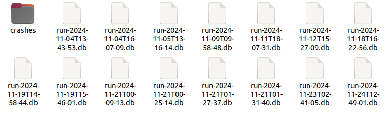

# 1. Firmware Overview

DISHY V4의 펌웨어의 주요 구성을 시각화하였다. BOOTFIP과 BOOT 파티션은 eMMC에 존재하는 부트 로더로서 ROM으로부터 비롯되는 신뢰할 수 있는 부트 체인을 형성한다. KERNEL 파티션은 FDT와 램디스크 이미지, 리눅스 커널을 포함한다. SX 파티션은 DISHY의 사용자 단말에서 실행 중 구동되는 SpaceX 자체 제작 바이너리와 여러 설정 파일을 포함하며, 커스텀 헤더로 무결성 인증을 거친다. 


V4 DISHY에서 eMMC-chip off하여 얻은 3,827,957,760 bytes의 펌웨어의 구조를 면밀히 분석하여, 시작 주소와 크기를 나타내었다. 주요 특징으로는,

- 같은 파티션들이 이름만 달리하여 여러 횟수에 걸쳐 등장한다(e.g. KERNEL_A/B). 파티션의 헥스값을 비교한 결과 실제 파일을 구성하는 내용은 동일하다. 펌웨어 업데이트 과정 중 펌웨어의 정확성을 담보하기 위함으로 추측된다.
- OBS_MAP 파티션은 V2에는 존재하지 않는 파티션으로, V4에 새로 장착된 파티션으로 생각된다. 그러나 EDR, DISH_CONFIG 파티션과 같이 LUKS 암호화되어 있기 때문에 파일 내용까지 자세하게 확인할 수 없었다.
- 파티션 테이블대로 모든 파티션을 합쳐도 크기는 289,217,536 bytes에 불과하나, 실제 eMMC-chip off한 펌웨어의 크기는  3,827,957,760 bytes이다. 3,538,740,224 bytes가 0x00으로 구성되어 있었다.

```
Segment               Start Address    Size      
BOOTFIP_0             0X00000000       0X00100000
BOOTFIP_1             0X00100000       0X00100000    
BOOTFIP_2             0X00200000       0X00100000    
BOOTFIP_3             0X00300000       0X00100000    
BOOTTERM1             0X00400000       0X00080000    
NOT USED              0X00480000       0X00080000
BOOTTERM2             0X00500000       0X00080000
NOT USED              0X00480000       0X00080000
BOOT_A_0              0X00600000       0X00100000    
BOOT_B_0              0X00700000       0X00100000    
BOOT_A_1              0X00800000       0X00100000    
BOOT_B_1              0X00900000       0X00100000    
UBOOT_TERM1           0X00A00000       0X00100000    
UBOOT_TERM2           0X00B00000       0X00100000
NOT USED              0X00C00000       0X002C0000
PER_VEHICLE_CONFIG_A  0X00EC0000       0X00020000    
PER_VEHICLE_CONFIG_B  0X00EE0000       0X00020000    
MTDOOPS               0X00F00000       0X00030000    
VERSION_INFO_A        0X00F30000       0X00020000    
VERSION_INFO_B        0X00F50000       0X00020000    
SECRETS_A             0X00F70000       0X00020000    
SECRETS_B             0X00F90000       0X00020000    
SXID                  0X00FB0000       0X00050000    
KERNEL_A              0X01000000       0X01800000    
CONFIG_A              0X02800000       0X00800000    
KERNEL_B              0X03000000       0X01800000    
CONFIG_B              0X04800000       0X00800000    
SX_A                  0X05000000       0X01800000    
SX_B                  0X06800000       0X01800000    
EDR                   0X08000000       0X093D1C00    
DISH_CONFIG           0X113D1C00       0X02000000    
OBS_MAP               0X133D1C00       0X08000000    
NOT USED              0X1B3D1C00       0XC8ECE3F0
```

---

# 2. Firmware Parsing

## 2.1. Partition Table

V4 DISHY에서 eMMC-chip off 하여 얻은 펌웨어를 대상으로 작성하였다.

각 파티션별 정밀한 분석을 위하여 전체 펌웨어를 파티션 테이블대로 분해해야 한다.

V4의 uBoot 소스코드는 공개되어 있지 않아 펌웨어에서 직접 추출한 uBoot에서 파티션 테이블을 추출하였다.(V4 uBoot 추출 방법은 [2-2에 후술](https://github.com/bob13-spacepirate/Starlink_Research/tree/main/V4%20DISHY#22-bootfip--bootfip-%ED%8C%8C%ED%8B%B0%EC%85%98))

[**parts_extractor_v4.py**]( /Script/parts_extractor_v4.py)


### 2.2. BOOTFIP & BOOTFIP 파티션

BOOTFIP과 FIP과 같은 파티션은 [ARM TF-A Project](https://www.trustedfirmware.org/projects/tf-a/) 기반으로 한 보안 부트 체인을 구성하고 있다. ARM TF-A 기반의 보안 부트 체인은 초기 단계부터 내부 ROM에 내장된 Root of Trust를 바탕으로 각 부트 이미지의 정당성을 검증하여 신뢰할 수 있는 실행 환경을 마련한다.

DISHY V4의 부트 체인은 ARM TF-A Project의 전형적인 멀티-스테이지 보안 부팅을 따르며, 이는 [QuarksLab의 선행 연구글](https://blog.quarkslab.com/starlink.html)에서 잘 설명되어 있다.

BOOTFIP과 FIP 파티션은 ARM TF-A Project의 fiptool을 이용하여 추출될 수 있다.

fiptool을 빌드하기 위해선 먼저 의존성을 설치해야 한다.

```bash
sudo apt update
sudo apt upgrade -y
sudo apt install -y git build-essential python3 python3-pip cmake libssl-dev uuid-dev
```

 GitHub 저장소에서 TF-A 소스 코드를 클론하고 빌드를 진행한다.

```bash
git clone https://github.com/ARM-software/arm-trusted-firmware.git
cd arm-trusted-firmware

//build fiptool
cd arm-trusted-firmware/tools/fiptool
export LD_LIBRARY_PATH=/usr/local/lib64
make OPENSSL_DIR=/usr/local/src/openssl-3.0.11
```

이후 fiptool의 unpack 명령어로 BOOTFIP과 BOOT 파티션을 분해할 수 있다.

```bash
//bootfip0
./fiptool unpack ./source/bootfip0 --out ./source/BOOTFIP_0

//fip_a.o
./fiptool unpack ./source/fip_a.0 --out ./source/BOOT_A_0
```

- 명령어 수행 결과 추출된 BOOTFIP 파티션은 아래와 같다.
    
    
    
    ```bash
    ./fiptool info ./source/fip_a.0
    Trusted Boot Firmware BL2: offset=0x230, size=0x2E220, cmdline="--tb-fw"
    EL3 Runtime Firmware BL31: offset=0x2E600, size=0x1C188, cmdline="--soc-fw"
    Non-Trusted Firmware BL33: offset=0x4A8A8, size=0x4B518, cmdline="--nt-fw"
    Trusted key certificate: offset=0x2E450, size=0x90, cmdline="--trusted-key-cert"
    SoC Firmware key certificate: offset=0x2E4E0, size=0x90, cmdline="--soc-fw-key-cert"
    Non-Trusted Firmware key certificate: offset=0x4A788, size=0x90, cmdline="--nt-fw-key-cert"
    Trusted Boot Firmware BL2 certificate: offset=0x1A0, size=0x90, cmdline="--tb-fw-cert"
    SoC Firmware content certificate: offset=0x2E570, size=0x90, cmdline="--soc-fw-cert"
    Non-Trusted Firmware content certificate: offset=0x4A818, size=0x90, cmdline="--nt-fw-cert"
    ```
    
    V2의 [uBoot 소스코드](https://github.com/SpaceExplorationTechnologies/u-boot)는 공개되어 있지만, V4의 경우 uBoot 소스코드가 공개되어 있지 않은데, fip 파티션에 있는 “—nt-fw”가 uBoot(BL33)에 해당한다. 
    
    
    
- 명령어 수행 결과 분해된 FIP 파티션은 아래와 같다.
    
    
    
    ```bash
    $ fiptool info BOOTFIP_0
    Trusted Boot Firmware BL2: offset=0x118, size=0xF178, cmdline="--tb-fw"
    Trusted Boot Firmware BL2 certificate: offset=0x88, size=0x90, cmdline="--tb-fw-cert"
    ```
    

### 2.3. KERNEL 파티션

KERNEL_A 파티션은 SpaceX 자체적으로 만든 Error Correcting Code, 즉 SXECC에 의해 보호되고 있다. SXECC 데이터는 eMMC 데이터가 비트 플립 등의 오류 없이 원래대로 읽힐 수 있도록 지원하여 eMMC의 무결성을 검증하는 역할을 한다. 해당 파티션을 unpack하여 FIT image를 얻을 수 없게 하는 역할을 하고 있기에, 이를 제거할 필요가 있다. 


쿽스랩은 V2 DISHY에서 FIT Image를 unpack할 수 있는 un-ecc python code를 제작하였고, V4 DISHY의 KERNEL 파티션도 동일한 ECC 메커니즘을 사용하는 것을 확인하였기 때문에,   [unecc 툴](https://github.com/quarkslab/starlink-tools/tree/main/unecc)을 사용하여 SXECC 데이터를 제거하였다.

un-ecc  코드를 설치하는 명령어은 아래와 같으며, 정상적인 동작을 위해 python-argparse를 설치해야 한다.

```bash
//code installation
git clone https://github.com/quarkslab/starlink-tools.git

//argparser installation
sudo apt-get update -y
sudo apt-get install -y python-argparse
```

아래 명령어로 SXECC 데이터가 제거된 이미지를 얻을 수 있다.

```bash
//un-ecc
cd starlink-tools/unecc
python3 unecc.py ./source/KERNEL_A ./source/KERNEL_A_UNECC
```

un-ecc code 적용 후 얻을 수 있는 FIT Image는 램디스크 이미지, 커널, FDT를 포함하므로 적절히 분해해야 한다. [SpaceX 깃허브](https://github.com/SpaceExplorationTechnologies/u-boot/blob/master/tools/dumpimage.c) 에서 FIT IMAGE를 분해하는 dumpimage 코드를 제공하고 있으며, 아래 명령어를 사용해 빌드할 수 있다.

```bash
//u-boot installation
git clone https://github.com/SpaceExplorationTechnologies/u-boot.git

//build dumpimage tool
cd u-boot
sudo apt-get install bison flex -y
make tools-only_defconfig
make tools-only
export PATH=$PATH:$PWD/tools  # use this command at u-boot directory
```

dumpimage -l 명령어로 FIT IMAGE의 구조를 파악한 결과이다.  V4에서 사용하는 FDT뿐만 아니라 구 버전 DISHY, 혹은 mini 버전 DISHY가 사용하는 펌웨어의 FDT를 모두 포함하여 총 33개의 FDT를 포함하고 있다. 

```jsx
└─$ dumpimage -l KERNEL_A_UNECC
FIT description: Signed dev image for catson platforms
Created:         Sun May  5 10:17:59 2024
 Image 0 (kernel)
  Description:  compressed kernel
  Created:      Sun May  5 10:17:59 2024
  Type:         Kernel Image
  Compression:  lzma compressed
  Data Size:    4104709 Bytes = 4008.50 KiB = 3.91 MiB
  Architecture: AArch64
  OS:           Linux
  Load Address: 0x80080000
  Entry Point:  0x80080000
# ------------------- 생략 -------------------------------
 Image 21 (rev4_prod1_fdt)
  Description:  rev4 prod 1 device tree
  Created:      Sun May  5 10:17:59 2024
  Type:         Flat Device Tree
  Compression:  uncompressed
  Data Size:    59352 Bytes = 57.96 KiB = 0.06 MiB
  Architecture: AArch64
  Load Address: 0x8f000000
# ------------------- 생략 -------------------------------
 Image 34 (ramdisk)
  Description:  compressed ramdisk
  Created:      Sun May  5 10:17:59 2024
  Type:         RAMDisk Image
  Compression:  uncompressed
  Data Size:    8761928 Bytes = 8556.57 KiB = 8.36 MiB
  Architecture: AArch64
  OS:           Linux
  Load Address: 0xb0000000
  Entry Point:  0xb0000000
# ------------------- 생략 -------------------------------
 
```

**ramdisk, kernel 추출**

dumpimage -T flat_dt -p N(번호) -o 명령어를 통해 FIT 이미지 내부에 들어있는 ramdisk와 kernel을 추출할 수 있다.

```jsx
mkdir -p ./source/ramdisk ./source/kernel

//ramdisk
dumpimage -T flat_dt -p 34 -o ./source/ramdisk/ramdisk.lzma ./source/linux
cd source/ramdisk
unxz ramdisk.lzma

//kernel
dumpimage -T flat_dt -p 0 -o ./source/kernel/kernel.lzma ./source/linux
cd source/kernel
unxz kernel.lzma
```

### 2.4. 커널 버전

unecc 작업 이후 dumpimage를 통해 얻은 kernel에 대한 추가 분석을 진행하였다. 특히 커널 버전과 컴파일 환경 등이 설정된 KERNEL_CONFIG를 확인해야 이후 에뮬레이팅을 성공적으로 수행할 수 있었다. 커널 버전의 경우 strings 명령어를 통해서도 쉽게 알 수 있었다.

```jsx
➜  KERNEL strings kernel | grep "Linux version" 

Linux version 6.1.38-rt12 (buildroot@buildroot) (aarch64-sxbr-linux-musl-gcc.br_real (Buildroot -ga67e963) 12.3.0, GNU ld (GNU Binutils) 2.39) #1 SMP PREEMPT_RT Fri Jun 21 16:20:33 UTC 2024
```

그러나 일반적으로 커널 config 파일이 커널 내에 gzip 압축된 형태로 존재한다는 점에 착안하여, DISHY V4가 실제로 사용 중인 config 파일을 찾아 추출하고자 하였다. 

```jsx
➜  KERNEL binwalk kernel

DECIMAL       HEXADECIMAL     DESCRIPTION
--------------------------------------------------------------------------------
0             0x0             Linux kernel ARM64 image, load offset: 0x0, image size: 15925248 bytes, little endian, 4k page size,
273984        0x42E40         SHA256 hash constants, little endian
8818688       0x869000        ELF, 64-bit LSB shared object, version 1 (SYSV)
8824400       0x86A650        SHA256 hash constants, little endian
**8838584       0x86DDB8        gzip compressed data, maximum compression, from Unix, last modified: 1970-01-01 00:00:00 (null date)**
9033992       0x89D908        Base64 standard index table
# ------------------- 생략 -------------------------------
```

binwalk의 결과로 gzip 형태의 데이터를 식별하여 dd 명령어로 추출하였다.

```jsx
dd if=kernel of=extracted_data.gz bs=1 skip=8838584 count=195408

195408+0 records in
195408+0 records out
195408 bytes (195 kB, 191 KiB) copied, 0.68041 s, 287 kB/s

➜  KERNEL gunzip extracted_data.gz

gzip: extracted_data.gz: decompression OK, trailing garbage ignored
```

그 결과로 [Kernel config 파일]( /Script/V4_DISHY_KERNEL_CONFIG.txt)을 획득하였으며, Linux 커널 [6.1.38 버전](https://lore.kernel.org/all/20230705174548.release-6.1.38@kdist.linux.kernel.org/T/)임을 확인했다.


```jsx
#
# Automatically generated file; DO NOT EDIT.
**# Linux/arm64 6.1.38 Kernel Configuration**
#
CONFIG_CC_VERSION_TEXT="aarch64-sxbr-linux-musl-gcc.br_real (Buildroot -ga67e963) 12.3.0"
CONFIG_CC_IS_GCC=y
CONFIG_GCC_VERSION=120300
```

### 2.5. sx runtime carving

sx (SX Runtime) 파티션은 사용자 단말(User Terminal)에 특화된 설정 파일들과 바이너리들을 포함하고 있다. 이 파티션은 Linux init 스크립트에 의해 `/sx/local/runtime` 디렉토리로 마운트된 후, 해당 볼륨 내의 바이너리들이 실행된다.

```jsx
➜  _sx_a.extracted ls -al _1080.extracted
total 20
drwxrwxr-x  5 general general 4096  9월 15 15:10 .
drwxrwxr-x  3 general general 4096  9월 15 15:10 ..
drwxr-xr-x  5 general general 4096  9월 15 15:12 bin
drwxr-xr-x 27 general general 4096  6월 28  1971 dat
drwxr-xr-x  2 general general 4096  6월 28  1971 revision_info
```

BoB 12기의 [V2 펌웨어](https://github.com/bob-doduk/Starlink-dishy-gen2-emulator)의 경우 ‘binwalk -Mre sx_a’ 명령어 결과로 생성된 ‘_1080.extracted’ 폴더에 스타링크 런타임 바이너리와 폴더를 모두 포함하고 있었지만, V4 펌웨어의 경우는 그렇지 않았다.

```jsx
$ binwalk -Mre SX_A

DECIMAL       HEXADECIMAL     DESCRIPTION
--------------------------------------------------------------------------------
6619528       0x650188        MySQL ISAM compressed data file Version 7
11778638      0xB3BA4E        AES S-Box
11778894      0xB3BB4E        AES S-Box
17929481      0x1119509       AES S-Box
17930077      0x111975D       AES S-Box
19718693      0x12CE225       gzip compressed data, maximum compression, has original file name: "", from Unix, last modified: 2024-03-08 21:01:54
19888892      0x12F7AFC       POSIX tar archive (GNU), owner user name: "app.bundle.web.js.gz"
```

V2 펌웨어와는 다르게 binwalk 툴의 결과물로도 런타임 바이너리 및 폴더를 얻을 수 없어, SX_A 파티션을 헥사 에디터로 열어 추가적으로 분석하였다. 특히, binwalk로 식별되지 않는 0x650188 이전의 데이터에 주목하였다.

```jsx
#-------------------------------------------------------------------
00000000: 7378 7665 7269 7479 0000 0000 00c8 5c01  sxverity......\.
00000010: 0000 0000 3257 0000 035a 0000 035a 0000  ....2W...Z...Z..
#-------------------------------------------------------------------
00000400: 7378 7665 7269 7479 0000 0000 00c8 5c01  sxverity......\.
00000410: 0000 0000 3257 0000 035a 0000 035a 0000  ....2W...Z...Z..
#-------------------------------------------------------------------
00000800: 7378 7665 7269 7479 0000 0000 00c8 5c01  sxverity......\.
00000810: 0000 0000 3257 0000 035a 0000 035a 0000  ....2W...Z...Z..
#-------------------------------------------------------------------
00000c00: 7378 7665 7269 7479 0000 0000 00c8 5c01  sxverity......\.
00000c10: 0000 0000 3257 0000 035a 0000 035a 0000  ....2W...Z...Z..
#-----다음이 실제 DATA 구간이다 -------------------------------------
00001000: 2d72 6f6d 3166 732d 015c c4a0 8537 8571  -rom1fs-.\...7.q
00001010: 7378 7665 7269 7479 0000 0000 0000 0000  sxverity........
00001020: 0000 0049 0000 0020 0000 0000 d1ff ff97  ...I... ........
00001030: 2e00 0000 0000 0000 0000 0000 0000 0000  ................
00001040: 0000 0060 0000 0020 0000 0000 d1d1 ff80  ...`... ........
00001050: 2e2e 0000 0000 0000 0000 0000 0000 0000  ................
00001060: 0000 0002 0000 0000 015c c416 33eb 8218  .........\..3...
00001070: 7275 6e74 696d 652e 7461 722e 7a73 7400  **runtime.tar.zst**.
00001080: 28b5 2ffd 0488 544f 003a 4b2c 0e2d 9090  (./...TO.:K,.-..
00001090: 553d ca79 2f99 6ee3 55f0 e3c3 3e8e 7a69  U=.y/.n.U...>.zi
000010a0: ab0e 9083 40d9 0956 8d70 644f 627d efdd  ....@..V.pdOb}..
000010b0: bdd1 9944 0000 0040 1500 72da 00ce 00d5  ...D...@..r.....
000010c0: 0034 b6c5 fd1a 8e5c e3d8 c9e6 758f 0d50  .4.....\....u..P
000010d0: 5429 54d2 6ffe e819 ddb6 0166 90ba 825d  T)T.o......f...]
```

SX_A 파티션 이미지의 초기에 나오는 ‘sxverity’ 헤더는 `device-mapper-verity(dm-verity)` 커널 기능을 래핑한 커스텀 헤더로, 데이터의 무결성과 진위성을 검증하는 역할을 하며 이 영역은 실제 데이터에 큰 영향을 주지 않는다. 0x1000(4096) 바이트 지점 이후부터 실제 유용한 데이터가 시작되며, 여기서 runtime.tar.zst 라는 파일명이 등장하기에 28b5 2ff5 바이트부터 추출하였다.

```jsx
└─$ ls

drwxrwxrwx 1 root root      8192 Jun 27  1971 bin
drwxrwxrwx 1 root root      8192 Jun 27  1971 dat
drwxrwxrwx 1 root root         0 Jun 27  1971 revision_info
```

V2 펌웨어의 runtime 폴더와 동일하게, bin, dat, revision_info를 얻을 수 있었다.

---

# 3. 에뮬레이팅 & 디버깅

---

에뮬레이팅 과정은 [쿽스랩](https://github.com/quarkslab/starlink-tools/tree/main/emulator)과 [bobdoduk(bob12)](https://github.com/bob-doduk/Starlink-dishy-gen2-emulator?tab=readme-ov-file)을 참고해 제작했다.

## 3.1. rootfs 생성

sx 디렉토리의 파일은 DISHY 동작에 필요한 바이너리가 들어있고, 에뮬레이팅을 위해 rootfs 폴더 안으로 옮긴다.

```
/sx/local/runtime
├─ bin/
│  ├─ emc_web_socket_server
│  ├─ rx_lmac
│  ├─ tx_lmac
│  ├─ user_terminal_control
│  ├─ user_terminal_frontend
│  ├─ connection_manager
│  └─ ... (Dishy 동작 관련 바이너리들)
└─ dat/
   ├─ common/
   │  └─ runtime
   └─ hw_specific/
```

## 3.2. 파일 설정

### 3.2.1. 원본 img 파일 생성

추출한 .bin 파일을 복사해 이름을 original.img로 변경한다.

### 3.2.2. is_production_hardware 패치

개발자 장비가 되어야 콘솔 창이 올라오며 로그인을 할 수 있다. `usr/bin/start_console` 을 확인하면 is_production_hardware의 값을 통해 console의 출력을 결정한다.

```bash
#!/bin/sh

#
# start_console
#
# Wrapper to launch serial console.
#

. whatami.sh

set -e

# default to output to console
consoletype=console

if [ "$(is_production_hardware)" -eq 1 ] && [ "$(whatVehicleAmI)" = "uterm" ] ; then
    # Discard console output for production user terminals.
    consoletype=ttynull
fi

# Start the serial console.
#
# Can't launch getty as /sbin/getty because runtime_priorities has "getty"
# hard-coded into it.
PATH=/sbin exec getty -L $consoletype 115200 vt100
```

`rootfs/usr/bin/is_production_hardware` 경로의 파일에서 결과를 echo 0으로 수정한다.

```bash
#!/bin/sh

#
# is_production_build.sh
#
# Wrapper to determine if Catson board is production fused.
#

set -e

fuseFile=/sys/devices/platform/soc/22400000.catson_fuses/fuse_map

if [ -e $fuseFile ]; then
    fuseMap=$(cat $fuseFile)
    if [ $(( fuseMap & 0x80 )) -eq 0 ]; then
        echo "0"
    else
        echo "0"
    fi
else
    # Default to the more secure option
    echo "0"
fi
```

### 3.2.3. 커널 파일 빌드

Linux version 6.1.38-rt12버전을 쿽스랩의 [build-kernel.sh](https://github.com/quarkslab/starlink-tools/blob/main/emulator/build-kernel.sh)를 사용해 빌드했다.

### 3.2.4. device tree 수정

 dumpimage 도구를 사용해 device tree를 추출한다.

```bash
dumpimage -l linux 
 Image 23 (rev4_prod3_fdt)
  Description:  rev4 prod 3 device tree
  Created:      Sun May  5 23:17:59 2024
  Type:         Flat Device Tree
  Compression:  uncompressed
  Data Size:    59352 Bytes = 57.96 KiB = 0.06 MiB
  Architecture: AArch64
  Load Address: 0x8f000000
  
 dumpimage -T flat_dt -p 23 -o ./devicetree.dtb ./linux 
 dtc -I dtb -O dts -o devicetree.dts devicetree.dtb
```

추출한 바이너리를 수정했지만 하드웨어 주변 기기가 qemu에 장착되어 있지 않기 때문에 제대로 작동하지 않았다.

에뮬레이트 실행에 필요한 부분만을 가져와 [dts 파일]( /Script/devicetree.dts)을 만들었다.

### 3.2.5. 부팅 프로세스 추가

| 바이너리명 |
| --- |
| user_terminal_frontend |
| user_terminal_control |
| aap_peek_poke |
| emc_web_socket_server |
| telemetry_funnel |
| software_update |

`/usr/sbin/sxruntime_start` 바이너리를 통해 초기화를 진행한다. 이때 초기 설정을 도와주는 스크립트는 `/etc/runtime_init`이다. 에뮬레이터 실행 시 바이너리가 동작하고 있도록 runtime_init 하단에 추가해 준다.

```
proc /init.sh
startup_flags wait

proc /sx/local/runtime/bin/user_terminal_frontend
startup_flags wait
```

`/etc/runtime_init` 에서 실행시킨 [init.sh]( /Script/devicetree.dts) 파일은 user_terminal_frontend가 grpc 통신을 위해 네트워크 구성을 한다. 이후 emc_web_socket_server와 telementry_funnel을 실행한다. 


### 3.2.6. user_terminal_frontend 바이너리 패치

user_terminal_frontend 바이너리는 isDev 함수에서 Timeout 함수가 존재하고, 시간이 지나면 디버거가 detach 되는 부분을 지워준다.

```go
// main.isDev
// positive sp value has been detected, the output may be wrong!
bool __golang main_isDev(__int64 a1, __int64 a2, void (**a3)(void))
{
  exec_Cmd *v3; // x0
  _BYTE *v4; // x0
  __int64 v5; // x1
  char v6; // w2
  char v7; // w0
  __int64 v8; // x3
  bool v9; // w0
  bool v11; // [xsp+56h] [xbp-42h]
  __int64 v12; // [xsp+58h] [xbp-40h]
  char v13[32]; // [xsp+60h] [xbp-38h] BYREF
  _BYTE *v14; // [xsp+80h] [xbp-18h]
  void (**v15)(void); // [xsp+88h] [xbp-10h]
  retval_63CCA0 v16; // 0:x0.40

  v15 = a3;
  v3 = (exec_Cmd *)os_exec_CommandContext(a1, a2, (__int64)"is_production_hardware", 22LL, 0LL, 0LL, 0LL);
  v16 = os_exec__ptr_Cmd_Output(v3);
  if ( v16.1.tab )
  {
    (*v15)();
    return 0LL;
  }
  else
  {
    v4 = (_BYTE *)runtime_slicebytetostring(v13, v16.0.ptr, v16.0.len);
    if ( v5 >= 1 )
    {
      v14 = v4;
      v12 = v5;
      v7 = runtime_memequal(&v4[v5 - 1], &unk_8873B8, 1LL);
      v5 = v12;
      v6 = v7;
      v4 = v14;
    }
    else
    {
      v6 = 0;
    }
    if ( (v6 & 1) != 0 )
    {
      v8 = v5 - 1;
      if ( !v5 )
        runtime_panicSliceAlen(v4, -1LL, 0LL);
    }
    else
    {
      v8 = v5;
    }
    v9 = v8 == 1 && *v4 == 48;
    v11 = v9;
    (*v15)();
    return v11;
  }
}
```

frontend의 init 과정 중 Go의 채널에 값을 보내는 동작과 받아오는 과정이 존재한다.  해당 과정이 자식 프로세스를 만들고 비동기 과정으로 진행되기 때문에 중간에 끊어지지 않도록os_signal_signal_enable 함수를 패치한다.

```go
// os/signal.signal_enable
// positive sp value has been detected, the output may be wrong!
void __golang os_signal_signal_enable(__int64 result, unsigned int *a2, __int64 a3, __int64 a4, __int64 a5)
{
  ;
}
```

### 3.2.7. qemu 세팅

1. 추출한 nt-w.bin 파일에서 sx-serialnum을 찾아서 부팅 인자로 넘겨준다.
2. 빌드한 커널 경로를 맞춰준다.
3. 수정한 device tree의 경로를 맞춰준다.
4. [qemu.sh 실행]( /Script/qemu.sh)

### 3.2.8. 바이너리 디버깅

에뮬레이팅 된 바이너리들은 arm64이기 때문에 `gdbserver-8.3.1-aarch64-le` 바이너리를 `rootfs/bin/` 에 넣는다.

**실행 방법**

- 에뮬레이터 시작 시 부팅된 바이너리에 attach를 해서 디버깅을 하는 방법
    
    ```bash
    [root@user1 ]# ps
    PID   USER     TIME  COMMAND
     1156 root      0:00 {sxruntime_start} builtin-logger
     1162 root      0:00 /sx/local/runtime/bin/emc_web_socket_server
     1163 root      0:01 ./bin/telemetry_funnel
     1164 root      0:01 user_terminal_frontend
     1189 root      0:00 ps
    [root@user1 ]# gdbserver-8.3.1-aarch64-le localhost:1234 --attach 1164
    Attached; pid = 1164
    Listening on port 1234
    Remote debugging from host 192.168.100.2, port 58372
    ```
    
    ```bash
    host pc
    gdb-multiarch
    pwndbg> target remote 192.168.100.1:1234
    Remote debugging using 192.168.100.1:1234
    Reading /sx/local/runtime/bin/user_terminal_frontend from remote target...
    ```
    

- 바이너리를 처음부터 디버깅 하는 방법
    
    ```bash
    [root@user1 ]# ps
    PID   USER     TIME  COMMAND
     1156 root      0:00 {sxruntime_start} builtin-logger
     1162 root      0:00 /sx/local/runtime/bin/emc_web_socket_server
     1163 root      0:01 ./bin/telemetry_funnel
     1164 root      0:01 user_terminal_frontend
     1189 root      0:00 ps
    [root@user1 ]# kill -9 1164
    [root@user1 ]# gdbserver-8.3.1-aarch64-le localhost:1234 /sx/local/runtime/bin/user_terminal_frontend
    Process /sx/local/runtime/bin/user_terminal_frontend created; pid = 1538
    Listening on port 1234
    ```
    
    ```bash
    host pc
    gdb-multiarch
    pwndbg> target remote 192.168.100.1:1234
    Remote debugging using 192.168.100.1:1234
    Reading /sx/local/runtime/bin/user_terminal_frontend from remote target...
    ```
    

---

# 4. 외부로 연결된 포트

## 4.1. user_terminal_frontend

user_terminal_frontend는 Starlink DISHY 상에서 구동되는 Go 기반 바이너리로, 사용자(또는 외부 UI)에게 디시 상태 조회, 설정 변경, 재부팅 명령 등의 고수준 기능을 제공하는 gRPC 서버를 구동하는 바이너리이다.


### 4.1.1. gRPC 기반 프론트엔드 동작

user_terminal_frontend 바이너리는 내부적으로  gRPC 및 gRPC-Web 서버를 각각 시작한다.

### 4.1.2. gRPC 서버: 192.168.100.1:9200

9200 포트는 디시 내부에서 주로 사용되는 gRPC API 진입점이며, 장치 내부 상태 제어 및 정보 조회 요청이 집중되는 핵심 포트이다. user_terminal_frontend는 gRPC 서버 구동과 서비스 등록에 있어서 표준 [grpc-go 오픈소스 라이브러리](https://github.com/grpc/grpc-go)를 활용한다.


### 4.1.3 gRPC Web Server: 192.168.100.1:9201

user_terminal_frontend는 [표준 gRPC-Web 함수](https://github.com/improbable-eng/grpc-web/blob/master/go/grpcweb/wrapper.go)들을 사용하면서도, 자체 제작 함수들로 보안성을 높이고 있다.


SpaceX 자체 제작함수들로 Referer 검증, IP 화이트리스트 설정, 타임아웃 기반 서버 시작, 사설 IP 여부 확인 등의 보안 정책을 구현하고 있다. 예를 들어, 요청의 Referer 헤더는 허용된 출처(http://dishy.starlink.com/) 에서 요청이 왔는지 확인하고 `Referer`가 없거나 허용된 출처가 아닌 경우, 403 상태 코드로 요청을 거부하는 로직을 확인할 수 있다.


---

### 4.1.4. TCP Proxy 설정 및 연결 포트

user_terminal_frontend는 특정 엔드포인트를 외부 서비스로 프록시하는 역할도 수행한다. 로그상 다음과 같은 형태로 TCP 프록시 설정이 확인되었다.

```less
INFO[...] TCPProxy: tcp://192.168.100.1:9203 -> tcp://connect.starlink.com:9005
INFO[...] TCPProxy: tcp://192.168.100.1:8001 -> tcp://wifi-update.svc.starlink.com:8001
INFO[...] TCPProxy: tcp://192.168.100.1:8002 -> tcp://wifi-update.svc.starlink.com:8002
INFO[...] TCPProxy: tcp://192.168.100.1:9204 -> tcp://tron-telemetry-at-pop.svc.starlink.com:8012
```

이를 통해 DISHY 내부에서 클라이언트(사용자 프론트엔드 앱)가 마치 로컬 gRPC/HTTP 리소스에 접근하듯이 외부 Starlink 클라우드 서비스에 연결할 수 있다.

그러나 TLS Root of Trust 및 CA 인증이 필요한 경우와 같이, 단순 연결만으로는 [클라우드 기능 활용]( /README.md#415-%EA%B6%8C%ED%95%9C-%EB%AA%A8%EB%8D%B8-%EB%B0%8F-%EC%9A%94%EC%B2%AD-%EC%9D%B8%EC%A6%9D)이 불가하고, 별도 인증 과정을 거쳐야 한다.

---

### 4.1.5. 권한 모델 및 요청 인증

**사용자 유형 (device_User)**

 main.(*DishControl).HandleRequest 함수는 gRPC 요청 처리 시 사용자 유형(device_User)을 기반으로 권한을 검증한다. 일반 유저 권한은 LAN(2)로 설정되며, 사용자 유형은 다음과 같다.

| 값 | 권한 | 역할 |
| --- | --- | --- |
| 1 | **GOD** | DEVELOPMENT 모드일때 활성화되는 권한으로, 모든 기능 사용 가능 |
| 2 | **LAN** | DEFAULT 권한. 일반 유저의 권한 |
| 3 | **CLOUD** | DISHY가 connect.starlink.com API 서버와 인증서 통신 후 활성화  |
| 4 | FACTORY | - |
| 5 | **ROUTER** | 인증서 검사 이후 gRPC 통신 TLS 인증 활성화 |
| 6 | GUEST_LAN | - |
| 7 | **SENSITIVE_COMMANDING** | 위성의 고도, 경도, 위도 계산하는 senitive_command(gRPC)에 필요 |
| 8 | LAN_TLS | - |

각 gRPC 요청은 허용된 사용자 유형 목록을 가지고 있으며, 요청 처리 시 Authenticator.Handle 함수를 통해 해당 요청을 실행할 수 있는 권한이 있는지 확인한다. 허용되지 않은 사용자 타입이면 "Permission denied" 응답을 반환한다.

user_terminal__frontend 바이너리의 실행 흐름에서 유저 권한을 DEFAULT로 2(LAN)으로 설정하는 로직이 존재하며, 이후 상위 권한에 해당하는지 추가적인 검증을 통해 사용자 유형을 변경한다.


**CLOUD(3)**

Cloud 권한을 얻기 위해선 DISHY가 Cloud 서버(connect.starlink.com:9005)와 신뢰 관계를 맺어야 한다. 이는 모뎀 유형이 **catapult**인 경우 Root of Trust 파일(/mnt/secrets/identity.crt)을 통해 CMRT(Certificate Managed Root of Trust)를 설정하거나, **catson**인 경우 STSafe 칩을 통해 보안 키를 확보하는 과정으로 검증이 이루어진다.


Root Of Trust가 설정된 이후에는 CA 인증서(cloud_root.crt)를 로드하고, Cloud 서버와 TLS로 인증 및 핸드셰이크를 수행한다. 

```bash
// 조건: CloudServerName > 0, RootOfTrust 확보, TLS 설정 완료
v116 = spacex_com_sx_device_StartClient("connect.starlink.com:9005", ... );
```

**ROUTER(5)**

Router 권한은 TLS 인증서를 갖춘 라우터나 특정 내부 경로를 통해 접근하는 경우 부여될 수 있다. 이는 LAN 접속보다 한 층 더 높은 신뢰 관계(인증서 기반)를 전제로 하며, LAN보다 더 민감한 명령 실행이 가능할 수 있으나, CLOUD처럼 클라우드 명령을 모두 수행할 수 있는 수준은 아닐 수 있다. Router 권한은 **Root of Trust 확보와 더불어 PEM 형식의 인증서 검증을** 통해 활성화될 수 있다.

### 4.1.6. 일반 gRPC 요청 처리

DISHY의 gRPC 서버에 gRPC 요청이 전송되었을 경우, main.(*DishControl).HandleRequest 함수에서 요청을 받아 각 gRPC 요청의 핸들러 함수에게 흐름을 넘겨준다.일반 gRPC 요청은사용자 유형과 요청에 허용된 유저 유형 리스트를 비교하여 권한을 검증한 후 상태 코드나 메세지를 담은 protobuf 응답을 전송하게 된다. 

예를 들어 getHistory gRPC 요청과 같은 경우, 권한 모델 중에서 **LAN(2), CLOUD(3), ROUTER(5) GOD(1)** 사용자 유형인지를 검사한다.


### 4.1.7. SensitiveCommand gRPC 요청 처리

일반 gRPC 요청과 달리 SensitiveCommand는 별도의 인증을 통해 처리한다. Cloud(3) 또는 God(1) 사용자만 실행 가능하며, 추가적으로 ID=7 키를 통한 서명 검증이 이루어지며, 명령어에 포함된 TargetId가 현재 디바이스의 deviceId와 일치해야 하는 등 일반 요청과는 다른 추가적인 인증 루틴이 존재한다.


이러한 복합 검증을 통과하면 위성의 위치 정보 조회(위도/경도/고도 등)와 같은 기능을 수행한다.

---

### 4.2. emc_web_socket_server

이 서버는 특정 포트에서 클라이언트의 연결을 수락하고, 웹 페이지(cmd-test-tool.html)와의 실시간 통신을 지원한다. 


cmd-test-tool.html 웹 페이지는 EMC_WEB_SOCKET_SERVER의 TCP 8065 포트(192.168.100.1:8065)로 웹소켓 연결을 시도한다. 그러나 연결 시도 후 즉시 연결이 끊어지는 현상이 발생한다. 

에뮬레이션한 emc_web_socket_server 바이너리에 안정적으로 연결하기 위해서는 WebSocket 프로토콜을 지원하는 도구를 사용해야 한다. 예를 들어, `curl` 명령어를 사용하여 WebSocket 연결을 시도할 수 있으며, 다음과 같은 명령어를 사용할 수 있다.  

```bash
curl -v \
  -H "Upgrade: websocket" \
  -H "Connection: Upgrade" \
  -H "Sec-WebSocket-Key: x3JJHMbDL1EzLkh9GBhXDw==" \
  -H "Sec-WebSocket-Version: 13" \
  http://192.168.100.1:8065/
```

아래와 같은 응답이 오고, 이후 즉시 연결이 끊어진다.

```bash
HTTP/1.1 101 Switching Protocols
Upgrade: websocket
Connection: Upgrade
Sec-WebSocket-Accept: aaPzg+1rnkMvpYYGJ3SE4U7X3DE=
```

디버깅 결과, 바이너리 내부에서 Prod 장비인지 Dev 장비인지 검사한 후 Prod 장비로 판단한 경우 외부의 웹소켓 연결을 종료하는 것으로 나타났다.


---

# 5. 내부로 연결된 포트

스타링크 DISHY 장치 내부에서는 여러 프로세스 간의 효율적인 통신을 위해 UDP 포트를 중심으로 한 슬레이트 메시지(Slate Message)를 사용한다. 내부 프로세스 간 정보 교환에 중요한 역할을 한다.

## 5.1. Slate Message

슬레이트 메시지는 스타링크 내부 프로세스 간의 데이터 교환을 위해 사용되는 자체 프로토콜이다. 이 메시지는 주로 UDP를 통해 전송되며, 빠르고 효율적인 통신을 가능하게 한다. 슬레이트 메시지는 헤더(Header)와 바디(Body)로 구성된다.

### 5.1.1 Slate Header

슬레이트 메시지의 헤더는 메시지의 유형과 상태를 정의하며, 다음과 같은 필드로 구성된다:

```c
typedef struct {
    uint32_t BwpType; // 프로토콜의 매직 넘버 (0x120)
    uint32_t Crc;     // 메시지 본문의 CRC 값
    int64_t  Seq;     // 시퀀스 번호
    uint32_t Frame;   // 프레임 번호 (메시지 분할 시 사용)
} SlateHeader;
```

| 필드 | 설명 |
| --- | --- |
| BwpType | 항상 `0x120`으로 고정된 값으로, 슬레이트 메시지임을 식별하는 매직 넘버 역할 |
| Crc | 메시지 본문의 무결성을 검증하기 위해 사용되며, 슬레이트 메시지의 종류(어떤 프로세스 간 메시지인지)마다 값이 다름 |
| Seq | 모든 메시지에 대해 증가하는 번호로, 메시지의 순서를 추적 |
| Frame | 메시지가 MTU(Maximum Transmission Unit)보다 큰 경우, 메시지를 여러 프레임으로 분할하여 전송할 때 사용 |

### 5.1.2 Slate Body

슬레이트 메시지의 바디는 각 프로세스 간에 필요한 정보나 명령을 전달한다. 바디의 구조는 프로세스 간 통신에 따라 다르며, sx/local/runtime/dat/common 디렉터리에 [p1]_to_[p2]의 형식(p1과 p2는 프로세스)으로 정의되어 있다.

**frontend_to_control**

user_terminal_frontend는 gRPC 요청을 받은 후 이를 bool, int8, int16, int32, int64, float64 형식으로 이루어진 slate body로 변환하여 user_terminal_control 바이너리로 전달한다.

```
# Slate share message from gRPC frontend process to main control process.
app_reboot                          bool
reset_button_pressed                bool
tilt_to_stowed                      bool
start_dish_cable_test_requests      uint32
update_request                      bool
sideload_update                     bool

grpc_auth.requests_as_no_user                   uint32
grpc_auth.requests_as_god                       uint32
grpc_auth.requests_as_lan                       uint32
grpc_auth.requests_as_cloud                     uint32
...
```

**control_to_emc_web_socket_server**

emc_web_socket_server 바이너리는 DISHY가 Prod 장비인지 Dev 장비인지 판단할 때 control로부터 송신된 slate message에서 emc.test_device과 unlock_service.unlocked가 true인지 확인한다.

```bash
emc.test_device                                         bool
unlock_service.unlocked                                 bool
...
```

### 5.1.3. localhost 설정

/sx/local/runtime/common/service_directory 파일에서 각 프로세스 간의 통신을 위한 포트 번호를 정의하고 있다.

```bash
################################################################################
# Frontend
control_to_frontend                       localhost   6500        udp_proto
frontend_to_control                       localhost   6501        udp_proto

################################################################################
# EMC WebSocket Server
control_to_emc_web_socket_server          localhost   27016       udp_proto
...
```

### 5.1.4. emc_web_socket_server 슬레이트 메세지 전송

[쿽스랩의 코드]( /Script/emc_web_socket_slate_sender.py)를 참고하여 에뮬레이터상에서 emc_web_socket_server 바이너리에 web socket을 보낸 직후 dev 장치라고 인식하게 하는 슬레이트 메세지를 전송하는 코드를 제작하였다.


### 5.1.5. Slate Message 퍼징

V4 DISHY 에뮬레이터에서 SX 런타임 바이너리를 대상으로 Slate Message 퍼징을 진행하였다. 
QuarksLab의 slate fuzzer은 boofuzz 기반으로 작성되었으며, 퍼징 기록을 db 형태로 저장하고 에뮬레이터에서 crash가 발생하면 해당 메세지 기록을 crashes 폴더에 저장한다.



control_to_frontend 규약으로 퍼징을 1000만 회 진행하였고, crash가 기록되어 에뮬레이터를 이용해 크래시를 재현하고자 하였다. QuarksLab의 starlink-tools 코드를 활용하여 기록된 메세지를 DISHY 에뮬레이터에 전송할 수 있는 [crash_injector.py]( /Script/crash_injector.py)를 제작하였다.

첫번째 인자로서 크래시를 구현할 메세지 규약(p1_to_p2)을, 두번째 인자로서 Fuzzer가 저장한 크래시 입력 파일을 설정하여 사용할 수 있다.

```bash
python3 crash_injector.py control_to_frontend ./boofuzz-results/crashes/control_to_frontend/05-11-2024_22-16-08/1-22-16-16
```

크래시를 재현하고자 동일한 메세지를 에뮬레이터에 전송하였지만 재현되지 않았다. 이는 Golang의 메모리 할당 요청이 동일하더라도 실제 메모리 할당 결과는 실행 시점의 메모리 상태에 따라 달라지는 등의 자체적인 메모리 관리 기법이 원인인 것으로 추측된다.
