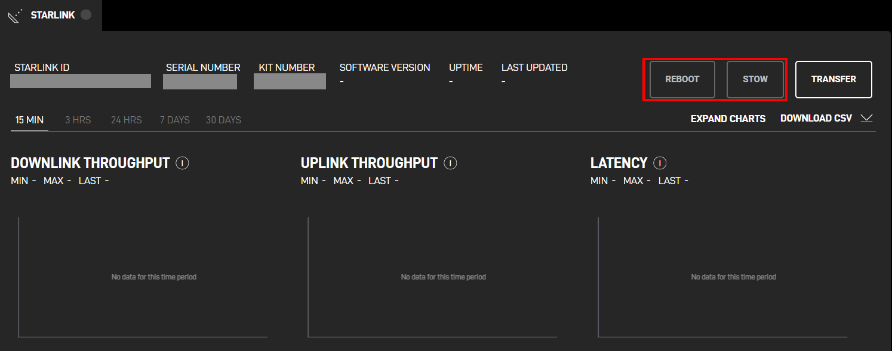

# gRPC

# 1. 개요

## 1.1. 스타링크에서의 gRPC사용

ROUTER와 DISHY 에서 사용하고 있는 gRPC 포트는 다음과 같다.

DISHY: `192.168.1.1: 9200`, `9201`

ROUTER: `192.168.100.1: 9000`, ~~9001~~ , `9005`

`00` 포트의 경우 grpcui를 통해 접근이 가능하다. 

`01` 포트의 경우 파이썬 스크립트, API서버를 통한 요청등 외부에서의 입력이 전달된다.

업데이트로 인하여 `9001` 포트가 `9005` 로 변경됨

## 1.2. gRPC로 접근해야 하는 이유

Starlink 시스템에서 gRPC는 대부분의 기능 및 설정을 제어하는 주요 인터페이스로 작동한다. 모든 주요 입력과 출력은 사전에 정의된 Fieldcode를 통해 gRPC를 경유하여 전달되므로, 이 인터페이스를 분석하지 않고는 시스템 동작과 관련된 취약점을 점검하기 어렵다. 

# 2. gRPC Tools

Proto파일 추출, 로컬에서 gRPC 요청 및 응답을 확인하기 위해서는 아래의 도구가 필요하다.

각각의 도구를 이용하여 gRPC메시지를 만들고 요청 보내는것이 가능하다.  

## 2.1. [grpcui](https://github.com/fullstorydev/grpcui)

GUI를 통해 gRPC 요청및 응답확인이 가능하다. 


```bash
# 설치
go install github.com/fullstorydev/grpcui/cmd/grpcui@latest

#사용
./grpcui -plaintext <ip>:<port>
```

## 2.2. [grpcurl](https://github.com/fullstorydev/grpcurl)

커맨드환경을 통해 json 형식으로 gRPC요청이 가능하다. 


```bash
#설치
go install github.com/fullstorydev/grpcui/cmd/grpcui@latest
```

## 2.3. [protodump](https://github.com/arkadiyt/protodump)

Protobuf로부터 proto파일을 추출하기 위해 사용한다. 

```bash
#설치
go install github.com/arkadiyt/protodump/cmd/protodump@latest

#사용
./protodump -file <file to extract from> -output <output directory>
```

# 3. Proto추출 및 Fieldcode

## 3.1. 추출 이유

Proto파일은 모든 Fieldcode가 작성되어있는 파일이다. 모든 기능에 대한 요청 및 응답의 구조, 권한 등이 작성되어있어 추출 및 분석이 필요하다.

## 3.2. Proto파일 추출

```bash
# 동작하고 있는 서비스를 조회한다
$ ./grpcurl -plaintext 192.168.1.1:9000 list
...
SpaceX.API.Device.Device
grpc.reflection.v1alpha.ServerReflection

# 서비스의 protoset 추출
# descriptors.protoset 파일이 생성됨
$ ./grpcurl -plaintext -protoset-out descriptors.protoset 192.168.1.1:9000 describe SpaceX.API.Device.Device

# proto 파일로 추출
# output 디렉토리에 추출된 파일이 저장된다
$ ./protodump -file descriptors.protoset -output ./output
```

추출한 [Proto](https://github.com/bob13-spacepirate/Starlink_Research/tree/main/gRPC/File/Proto) 파일


### 3.2.1. 구조

```
extracted_zip/
├── google/
│   └── protobuf/
│       ├── timestamp.proto
│       └── wrappers.proto
└── spacex/
    ├── api/
    │   ├── common/
    │   │   └── status/
    │   │       └── status.proto
    │   └── device/
    │       ├── command.proto
    │       ├── common.proto
    │       ├── device.proto
    │       ├── dish.proto
    │       ├── dish_config.proto
    │       ├── transceiver.proto
    │       ├── wifi.proto
    │       ├── wifi_config.proto
    │       ├── wifi_util.proto
    │       └── services/
    │           └── unlock/
    │               └── service.proto
    ├── satellites/
    │   └── network/
    │       └── ut_disablement_codes.proto
    └── telemetron/
        └── public/
            └── common/
                └── time.proto

```

## 3.3. Fieldcode별 동작 및 권한

### 3.3.1. 권한

대부분의 기능요청을 보낼떄 PERMISSION_DENIED응답이 반환된다.

추출된 proto파일에서 user 구조체를 통해 권한의 종류를 확인했다.

```protobuf
enum User {
  NO_USER = 0;
  GOD = 1;
  LAN = 2;  # 로컬유저
  CLOUD = 3; # api 서버
  FACTORY = 4;
  ROUTER = 5;
  GUEST_LAN = 6;
  SENSITIVE_COMMANDING = 7;
  LAN_TLS = 8;
}
```

### 3.3.2. 추출한 기능 목록 및 기능정리

추출된 [Fieldcode](https://github.com/bob13-spacepirate/Starlink_Research/tree/main/gRPC/File/Fieldcode)를 통한 기능 목록 및 요청에 대한 응답은 아래에 첨부된 파일에 각각의 기능별로 정리가 되어있다. 


| 기능명 | 필드코드 | DISHY | ROUTER | 기능 | URL |
| --- | --- | --- | --- | --- | --- |
| signed_request | 15 | PermissionDenied | PermissionDenied |  | SpaceX.API.Device.SignedData |
| get_next_id | 1006 | Unimplemented | Unimplemented |  | SpaceX.API.Device.GetNextIdRequest |
| sensitive_request | 1078 | PermissionDenied | Unimplemented |  | SpaceX.API.Device.SignedData |
| authenticate | 1005 | PermissionDenied | PermissionDenied |  | SpaceX.API.Device.AuthenticateRequest |
| enable_debug_telem | 1034 | Unimplemented | PermissionDenied |  | SpaceX.API.Device.EnableDebugTelemRequest |
| factory_reset | 1011 | Unimplemented | PermissionDenied | 공장초기화 | SpaceX.API.Device.FactoryResetRequest |
| get_device_info | 1008 | OK | OK | 기기 정보 확인 | SpaceX.API.Device.GetDeviceInfoRequest |
| get_history | 1007 | OK | OK | ping 기록 확인 | SpaceX.API.Device.GetHistoryRequest |
| get_log | 1012 | Unimplemented | PermissionDenied |  | SpaceX.API.Device.GetLogRequest |
| get_network_interfaces | 1015 | Unimplemented | OK | 네트워크 인터페이스 정보 | SpaceX.API.Device.GetNetworkInterfacesRequest |
| get_ping | 1009 | Unimplemented | OK | ping에 사용하는 외부주소 | SpaceX.API.Device.GetPingRequest |
| ping_host | 1016 | Unimplemented | OK | ping 호스트 설정 | SpaceX.API.Device.PingHostRequest |
| get_status | 1004 | OK | OK | 기기 상태정보 확인 | SpaceX.API.Device.GetStatusRequest |
| reboot | 1001 | OK | OK | 기기 재시작 | SpaceX.API.Device.RebootRequest |
| set_sku | 1013 | Unimplemented | PermissionDenied |  | SpaceX.API.Device.SetSkuRequest |
| set_trusted_keys | 1010 | Unimplemented | Unimplemented |  | SpaceX.API.Device.SetTrustedKeysRequest |
| speed_test | 1003 | Unimplemented | Internal |  | SpaceX.API.Device.SpeedTestRequest |
| update | 1014 | PermissionDenied | OK | 업데이트 기능 시작 | SpaceX.API.Device.UpdateRequest |
| get_location | 1017 | PermissionDenied | Unimplemented |  | SpaceX.API.Device.GetLocationRequest |
| get_heap_dump | 1019 | Unimplemented | PermissionDenied |  | SpaceX.API.Device.GetHeapDumpRequest |
| restart_control | 1020 | Unimplemented | PermissionDenied |  | SpaceX.API.Device.RestartControlRequest |
| fuse | 1021 | Unimplemented | PermissionDenied |  | SpaceX.API.Device.FuseRequest |
| get_persistent_stats | 1022 | Unimplemented | Unimplemented |  | SpaceX.API.Device.GetPersistentStatsRequest |
| get_connections | 1023 | Unimplemented | PermissionDenied |  | SpaceX.API.Device.GetConnectionsRequest |
| start_speedtest | 1027 | Unimplemented | OK | 네트워크 속도 테스트 | SpaceX.API.Device.StartSpeedtestRequest |
| get_speedtest_status | 1028 | Unimplemented | OK | 속도 테스트 결과 | SpaceX.API.Device.GetSpeedtestStatusRequest |
| report_client_speedtest | 1029 | Unimplemented | OK |  | SpaceX.API.Device.ReportClientSpeedtestRequest |
| initiate_remote_ssh | 1030 | Unimplemented | Unimplemented |  | SpaceX.API.Device.InitiateRemoteSshRequest |
| self_test | 1031 | PermissionDenied | Unimplemented |  | SpaceX.API.Device.SelfTestRequest |
| set_test_mode | 1032 | PermissionDenied | Unimplemented |  | SpaceX.API.Device.SetTestModeRequest |
| software_update | 1033 | FailedPrecondition | Unimplemented | 업데이트 파일 전송 | SpaceX.API.Device.SoftwareUpdateRequest |
| iq_capture | 1035 | PermissionDenied | Unimplemented |  | SpaceX.API.Device.IQCaptureRequest |
| get_radio_stats | 1036 | Unimplemented | OK | 주파수 정보 | SpaceX.API.Device.GetRadioStatsRequest |
| time | 1037 | PermissionDenied | Unimplemented |  | SpaceX.API.Device.GetTimeRequest |
| run_iperf_server | 1038 | Unimplemented | PermissionDenied |  | SpaceX.API.Device.RunIperfServerRequest |
| dish_stow | 2002 | OK | Unimplemented | DISHY 접기  | SpaceX.API.Device.DishStowRequest |
| start_dish_self_test | 2012 | OK | Unimplemented |  | SpaceX.API.Device.StartDishSelfTestRequest |
| dish_get_context | 2003 | PermissionDenied | Unimplemented |  | SpaceX.API.Device.DishGetContextRequest |
| dish_get_obstruction_map | 2008 | OK | Unimplemented |  | SpaceX.API.Device.DishGetObstructionMapRequest |
| dish_set_emc | 2007 | PermissionDenied | Unimplemented |  | SpaceX.API.Device.DishSetEmcRequest |
| dish_get_emc | 2009 | PermissionDenied | Unimplemented |  | SpaceX.API.Device.DishGetEmcRequest |
| dish_set_config | 2010 | PermissionDenied | Unimplemented | DISHY 설정 | SpaceX.API.Device.DishSetConfigRequest |
| dish_get_config | 2011 | OK | Unimplemented | DISHY 설정 정보 확인 | SpaceX.API.Device.DishGetConfigRequest |
| dish_power_save | 2013 | OK | Unimplemented |  | SpaceX.API.Device.DishPowerSaveRequest |
| dish_inhibit_gps | 2014 | OK | Unimplemented |  | SpaceX.API.Device.DishInhibitGpsRequest |
| dish_get_data | 2015 | PermissionDenied | Unimplemented |  | SpaceX.API.Device.DishGetDataRequest |
| dish_prioritized_update | 2016 |  | Unimplemented |  | SpaceX.API.Device.DishPrioritizedUpdateRequest |
| dish_clear_obstruction_map | 2017 | OK | Unimplemented |  | SpaceX.API.Device.DishClearObstructionMapRequest |
| wifi_get_clients | 3002 | Unimplemented | OK | 연결기기 정보 | SpaceX.API.Device.WifiGetClientsRequest |
| wifi_get_ping_metrics | 3007 | Unimplemented | PermissionDenied |  | SpaceX.API.Device.WifiGetPingMetricsRequest |
| wifi_set_config | 3001 | Unimplemented | PermissionDenied |  | SpaceX.API.Device.WifiSetConfigRequest |
| wifi_get_config | 3009 | Unimplemented | OK | 설정 정보 | SpaceX.API.Device.WifiGetConfigRequest |
| wifi_setup | 3003 | Unimplemented | FailedPrecondition | 최초1회 wifi 설정 | SpaceX.API.Device.WifiSetupRequest |
| wifi_set_mesh_device_trust | 3012 | Unimplemented | InvalidArgument |  | SpaceX.API.Device.WifiSetMeshDeviceTrustRequest |
| wifi_set_mesh_config | 3013 | Unimplemented | Unimplemented |  | SpaceX.API.Device.WifiSetMeshConfigRequest |
| wifi_get_client_history | 3015 | Unimplemented | OK |  | SpaceX.API.Device.WifiGetClientHistoryRequest |
| wifi_set_client_given_name | 3017 | Unimplemented | PermissionDenied |  | SpaceX.API.Device.WifiSetClientGivenNameRequest |
| wifi_set_aviation_conformed | 3016 | Unimplemented | PermissionDenied |  | SpaceX.API.Device.WifiSetAviationConformedRequest |
| wifi_self_test | 3018 | Unimplemented | OK |  | SpaceX.API.Device.WifiSelfTestRequest |
| wifi_calibration_mode | 3019 | Unimplemented | PermissionDenied |  | SpaceX.API.Device.WifiCalibrationModeRequest |
| wifi_guest_info | 3020 | Unimplemented | OK | 연결된 기기 정보 | SpaceX.API.Device.WifiGuestInfoRequest |
| wifi_rf_test | 3021 | Unimplemented | PermissionDenied |  | SpaceX.API.Device.WifiRfTestRequest |
| wifi_get_firewall | 3024 | Unimplemented | PermissionDenied |  | SpaceX.API.Device.WifiGetFirewallRequest |
| wifi_toggle_poe_negotiation | 3025 | Unimplemented | PermissionDenied |  | SpaceX.API.Device.WifiTogglePoeNegotiationRequest |
| wifi_factory_test_command | 3026 | Unimplemented | PermissionDenied |  | SpaceX.API.Device.WifiFactoryTestCommandRequest |
| wifi_start_local_telem_proxy | 3027 | Unimplemented | PermissionDenied |  | SpaceX.API.Device.WifiStartLocalTelemProxyRequest |
| wifi_unbypass | 3022 |  | Unimplemented |  | SpaceX.API.Device.WifiUnbypassRequest |
| transceiver_if_loopback_test | 4001 | Unimplemented | Unimplemented |  | SpaceX.API.Device.TransceiverIFLoopbackTestRequest |
| transceiver_get_status | 4003 | Unimplemented | Unimplemented |  | SpaceX.API.Device.TransceiverGetStatusRequest |
| transceiver_get_telemetry | 4004 | Unimplemented | Unimplemented |  | SpaceX.API.Device.TransceiverGetTelemetryRequest |
| start_unlock | 5000 | Unimplemented | OK |  | SpaceX.API.Device.Services.Unlock.StartUnlockRequest |
| finish_unlock | 5001 | Unimplemented | OK |  | SpaceX.API.Device.Services.Unlock.FinishUnlockRequest |
| get_diagnostics | 6000 | OK | OK |  | SpaceX.API.Device.GetDiagnosticsRequest |

# 4. gRPC 요청 및 응답, 해석

## 4.1. grpc 상태코드

| Code | Status | 의미 | 설명 |
| --- | --- | --- | --- |
| 0 | OK | 성공 | 호출이 정상적으로 완료 |
| 1 | CANCELLED | 취소됨 | 작업이 취소. 클라이언트가 요청을 취소하거나 서버에서 취소 처리된 경우 |
| 2 | UNKNOWN | 알 수 없음 | 예상치 못한 에러가 발생. 예외적으로 발생하는 에러를 포함 |
| 3 | INVALID_ARGUMENT | 잘못된 인수 | 잘못된 파라미터를 전달한 경우 |
| 4 | DEADLINE_EXCEEDED | 시간 초과 | 요청이 클라이언트가 설정한 시간 내에 완료되지 않음 |
| 5 | NOT_FOUND | 찾을 수 없음 | 요청한 리소스를 찾을 수 없음 |
| 6 | ALREADY_EXISTS | 이미 존재함 | 리소스가 이미 존재하여 요청이 실패 |
| 7 | PERMISSION_DENIED | 권한 없음 | 권한 부족으로 요청이 거부(인증 및 권한 관련) |
| 8 | RESOURCE_EXHAUSTED | 자원 부족 | 시스템 자원이 부족하거나 사용량 제한에 도달 |
| 9 | FAILED_PRECONDITION | 전제 조건 실패 | 요청의 실행이 불가능한 상태 |
| 10 | ABORTED | 중단됨 | 병렬 처리가 실패하거나 트랜잭션이 충돌 |
| 11 | OUT_OF_RANGE | 범위 초과 | 유효한 범위를 벗어난 요청 |
| 12 | UNIMPLEMENTED | 구현되지 않음 | 호출된 메소드가 서버에서 지원되지 않음 |
| 13 | INTERNAL | 내부 에러 | 서버의 내부에서 예상치 못한 문제가 발생 |
| 14 | UNAVAILABLE | 서비스 이용 불가 | 서비스가 현재 사용 불가능하거나 네트워크 문제로 인해 접근할 수 없음 |
| 15 | DATA_LOSS | 데이터 손실 | 비정상적인 데이터 손실 |
| 16 | UNAUTHENTICATED | 인증되지 않음 | 인증 실패로 인해 호출이 거부 |

**성공:** `OK (0)`

**클라이언트 오류:** `CANCELLED (1)`, `INVALID_ARGUMENT (3)`, `NOT_FOUND (5)`, `ALREADY_EXISTS (6)`, `FAILED_PRECONDITION (9)`, `OUT_OF_RANGE (11)`

**권한 및 인증 문제:** `PERMISSION_DENIED (7)`, `UNAUTHENTICATED (16)`

**서버 오류:** `UNKNOWN (2)`, `DEADLINE_EXCEEDED (4)`, `RESOURCE_EXHAUSTED (8)`, `ABORTED (10)`, `UNIMPLEMENTED (12)`, `INTERNAL (13)`, `UNAVAILABLE (14)`, `DATA_LOSS (15)`

## 4.2. Fieldcode to gRPC request

### 4.2.1. gRPC hex코드 수집


grpcui를 통해 명령을 보내는것을 와이어샤크로 확인하면 hex값으로 gRPC 메시지 확인이 가능하다.


hex 데이터 수집을 반복하면서 각 데이터의 연관성을 발견하여 해당 규칙을 분석하고 계산해주는 스크립트를 작성 하였다

### 4.2.2 gRPC의 구조

gRPC의 기본 구조는 압축 여부 + 총 바이트 길이 + 명령어 + 데이터 길이 + 데이터 형태이다.
명령어+길이+데이터 조합을 이어 붙여서 여러 입력을 같이 보낸다.

```
[압축] + [총길이] + [명령어] + [데이터길이] + [데이터] + [명령어] + [데이터길이] + [데이터]
```

이중 `[명령어]` 부분이 Fieldcode의 hex값이다. 

**[n = ( Fieldcode * 8 ) + 2]** 의 계산식을 이용하는 `VarInt` 방식과 `MSB` 방식을 이용하여 Fieldcode를 hex로 변환하여 gRPC 명령어로 이용한다.

총길이는 인코딩없이 4바이트로 표현하며  데이터의 길이는 `MSB` 방식을 이용하여 표현한다.


[Fieldcode_to_hex.py](https://github.com/bob13-spacepirate/Starlink_Research/blob/main/gRPC/Script/Fieldcode_to_hex.py)

Fieldcode를 hex gRPC메시지로 변경하는 로직이다.

```python
def encode_varint(n):
    """ 정수 n을 VarInt 방식으로 인코딩하는 함수 """
    result = []
    while True:
        byte = n & 0x7F  # 하위 7비트 추출
        n >>= 7  # n을 7비트 오른쪽으로 이동
        if n != 0:
            result.append(byte | 0x80)  # MSB를 1로 설정하여 다음 바이트가 있음을 표시
        else:
            result.append(byte)  # 마지막 바이트이므로 MSB는 0
            break
    return result
  
def makedata(fieldcode):
    """ 주어진 필드코드에 대한 데이터값을 생성하는 함수 """
    n = fieldcode * 8 + 2
    varint_bytes = encode_varint(n)
    length_byte = len(varint_bytes) + 1  # VarInt 바이트 수 + 1
    data_value = [0x00, 0x00, 0x00, 0x00, length_byte] + varint_bytes + [0x00]
    # 바이트 배열을 16진수 문자열로 변환
    data_value_hex = "".join("{:02X}".format(b) for b in data_value)
    return data_value_hex
```

이렇게 나온 hex 값은 `와이어 타입`과 `Fieldcode`로 나누어지는데 이를 이용하여 grpc메시지를 구조화 하고 구분하는데 도움이 된다.

```
Fieldcode 3001번 = ca bb 01라는 값을 예시로 할때
MSB를 고려해야 한다

ca = 1100 1010
bb = 1011 1011
01 = 0000 0001
여기에서 MSB인 최상위 1비트를 제거하고 이어붙인다. 

->01 bb ca = [000 0001] [011 1011] [100 1010]
	와이어타입 = 하위 3비트 = 010 = 2(Length-delimited)
	필드번호 = 상위 나머지비트 = 101110111001 = 3001

```

| 와이어 타입 | 이름 | 특징 | 데이터타입 |
| --- | --- | --- | --- |
| 0 | Varint | 가변 길이 정수 | `int32`, `int64`, `uint32`, `uint64`, `sint32`, `sint64`, `bool`, `enum` |
| 1 | 64비트 | 고정 8바이트 | `fixed64`, `sfixed64`, `double` |
| 2 | Length-delimited | 길이 지정 후 데이터 | `string`, `bytes`, `메시지`, `packed repeated fields` |
| 3 | Start Group | 그룹 시작 | 사용안함 |
| 4 | End Group | 그룹 끝 | 사용안함 |
| 5 | 32비트 | 고정 4바이트 | `fixed32`, `sfixed32`, `float` |


[Split_from_gRPC.py](https://github.com/bob13-spacepirate/Starlink_Research/blob/main/gRPC/Script/Split_from_gRPC.py) 

gRPC 명령어의 구조를 분석하여 필요한 부분의 데이터 수정을 할 수 있다

```python
def process_grpc_message(hex_string):
    compressed_flag = byte_array[0]
    compressed_flag_hex = byte_array[0:1].hex()
    message_length_bytes = byte_array[1:5]
    message_length = int.from_bytes(message_length_bytes, byteorder="big")
    message_length_hex = message_length_bytes.hex()

    index = 5  # 헤더 이후부터 메시지 본문 시작

    # 메시지 본문의 끝 인덱스 계산
    message_end = index + message_length

    # 메시지 본문 처리
    while index < message_end:
        # 필드 키 읽기
        field_key, key_size, field_key_bytes = decode_varint_with_bytes(
            byte_array, index
        )
        field_key_hex = " ".join(f"{b:02x}" for b in field_key_bytes)
        index += key_size

        # 와이어 타입과 필드 번호 추출
        wire_type = field_key & 0x07
        field_number = field_key >> 3

        print(f"필드 번호: {field_number} [{field_key_hex}], 와이어 타입: {wire_type}")

        # 데이터 처리
        if wire_type == 0:  # Varint
            value, value_size, value_bytes = decode_varint_with_bytes(byte_array, index)
            value_hex = " ".join(f"{b:02x}" for b in value_bytes)
            index += value_size
            print(f"값: {value} [{value_hex}]")
        elif wire_type == 2:  # Length-delimited
            length_value, length_size, length_bytes = decode_varint_with_bytes(
                byte_array, index
            )
            length_hex = " ".join(f"{b:02x}" for b in length_bytes)
            index += length_size
            data = byte_array[index : index + length_value]
            data_hex = " ".join(f"{b:02x}" for b in data)
            index += length_value
            print(f"길이: {length_value} [{length_hex}], 데이터: [{data_hex}]")
        elif wire_type == 5:  # 32-bit
            data = byte_array[index : index + 4]
            data_hex = " ".join(f"{b:02x}" for b in data)
            index += 4
            print(f"32비트 데이터: [{data_hex}]")
        elif wire_type == 1:  # 64-bit
            data = byte_array[index : index + 8]
            data_hex = " ".join(f"{b:02x}" for b in data)
            index += 8
            print(f"64비트 데이터: [{data_hex}]")
        else:
            print(f"알 수 없는 와이어 타입입니다: {wire_type}")
            break
```


### 4.2.3. gRPC Request

스크립트를 이용하여 외부에서 요청을 보내기 위해서는  `content-type` 헤더의 값을 `application/grpc-web+proto`  로 지정해야 이용이 가능하다.


[hexRequest(reboot).py](https://github.com/bob13-spacepirate/Starlink_Research/blob/main/gRPC/Script/hexRequest(reboot).py) 

APP에서 명령 요청 보내는 패킷을 활용하여 코드를 작성했다.

```python

# 라우터 및 디쉬 재부팅 요청

# 16진수 데이터로 변환
binary_data = bytes.fromhex("0000000003ca3e00")  # reboot command

# POST 요청 보내기
response = requests.post(url, headers=headers, data=binary_data)

# URL 설정
router_url = "http://192.168.1.1:9001/SpaceX.API.Device.Device/Handle"
dishy_url = "http://192.168.100.1:9201/SpaceX.API.Device.Device/Handle"
```

### 4.2.4. gRPC to API Server

공식 웹페이지(www.starlink.com) 에는 계정활성화 이후 기기를 관리하는 페이지가 존재한다.




`REBOOT`, `STOW` 기능은 계정이 활성화 되어야 하고 DISHY가 위성을 통해 네트워크에 연결이 되어야 사용이 가능하다. 

기능을 동작 시키면 option태그로 요청을 보내고 900초 동안 유효한 `인증 쿠키`를 받는다.

인증 요청 이후 쿠키를 포함하여 `API 서버`에 gRPC요청을 보낸다. 

gRPC명령어는 `Fieldcode 13번, 기기의정보(UT,Router)`가 들어가고 이후 동작시킨 `명령어`가 들어간다.


`grpcui`를 통한 응답과의 결과 비교를 통해 `Api서버` 의 명령은 기기에 cloud권한으로 전달 되는 것 을 확인했다. 

# 5. Fuzzing & Bruteforce

프록시 도구를  및 스크립트를 이용하여 gRPC 명령어 및 기기정보를 수정하여 인증인가 우회가 가능한지 테스트했다. 

## 5.1. Find hidden Field code

[Fieldcode_to_hex.py](https://github.com/bob13-spacepirate/Starlink_Research/blob/main/gRPC/Script/Fieldcode_to_hex.py) 코드를 수정하여 모든 Fieldcode를 순회하며 요청을 보내고 응답을 확인하였으나 Proto파일에 명시한 이외의 기능은 존재하지 않았다. 

## 5.2. Change User

[4.2.4. gRPC to API Server](https://github.com/bob13-spacepirate/Starlink_Research/tree/main/gRPC#424-grpc-to-api-server) 의 방법과 프록시 도구를 이용하여 명령어 수정을 통해 다른 유저의 정보를 수집할 수 있는지 확인 하였으나 타인의 정보에 접근할 수 없었다. 쿠키를 이용하여 기기정보외에 추가 인증을 하는것을 확인했다. 

## 5.3. gRPC Modify

[4.2.4. gRPC to API Server](https://github.com/bob13-spacepirate/Starlink_Research/tree/main/gRPC#424-grpc-to-api-server) 의 방법과 프록시 도구를 이용하여 명령어 수정을 통해 권한이 없는 기능사용을 테스트 했다. 

취약한 설정을 할 수 있는 기능을 위주로 진행하였으며 권한 테스트를 위해 `PERMISSION_DENIED` 인 명령어를 사용했다. 

대부분의 명령어는 `3번`과 함께 `COMMAND_NOT_ALLOWED` 반응이 나왔다. 

`wifi_set_config` 기능만 ok 반응이였고 실제로 반영이 되었으나 해당 기능은 모바일에서 설정 가능한 기능이였다.
